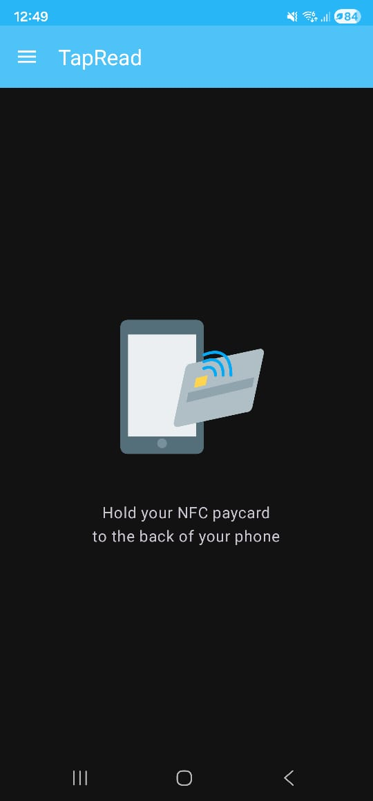
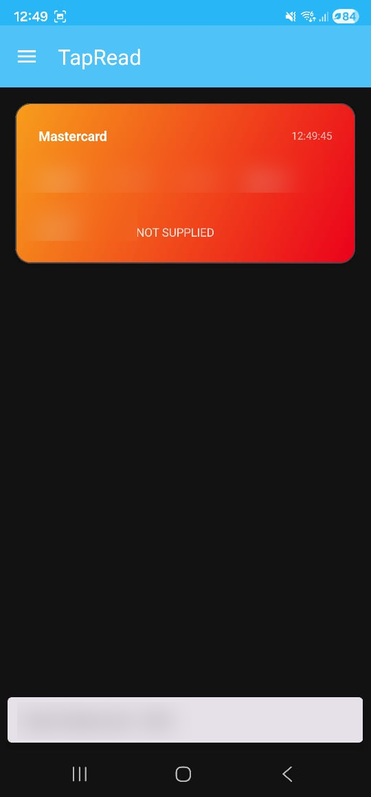
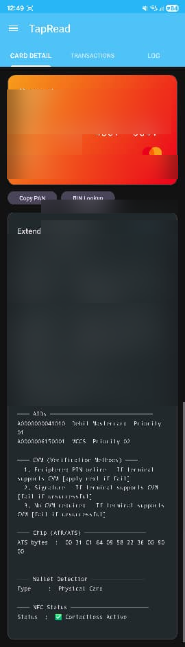
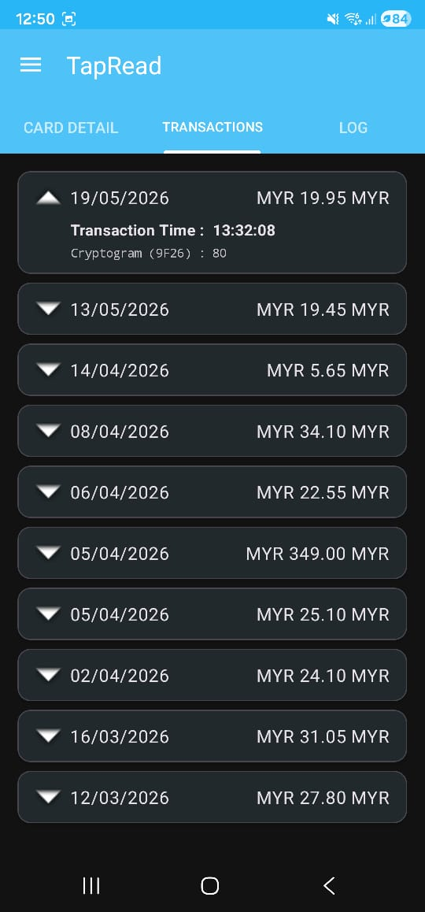
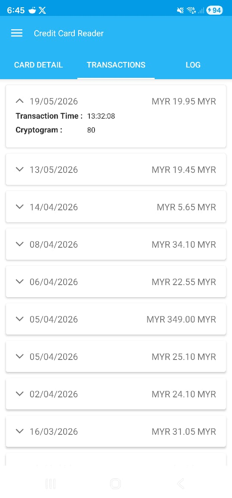
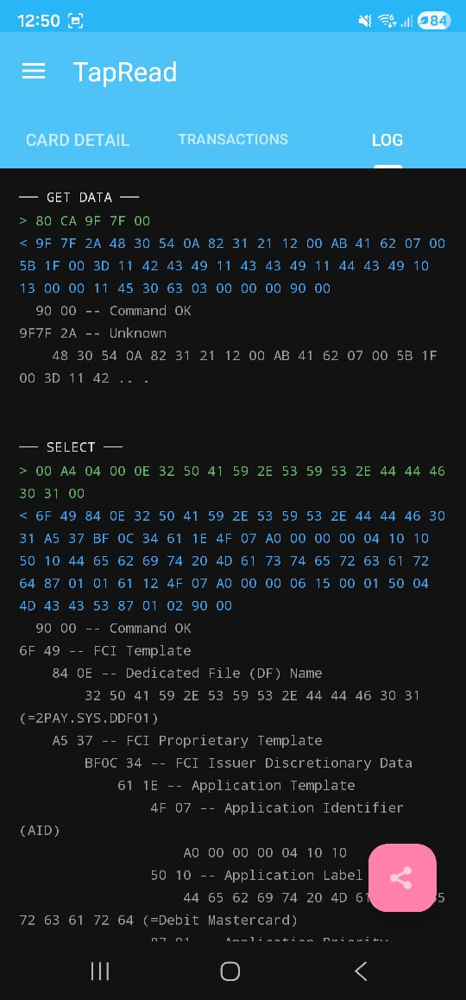
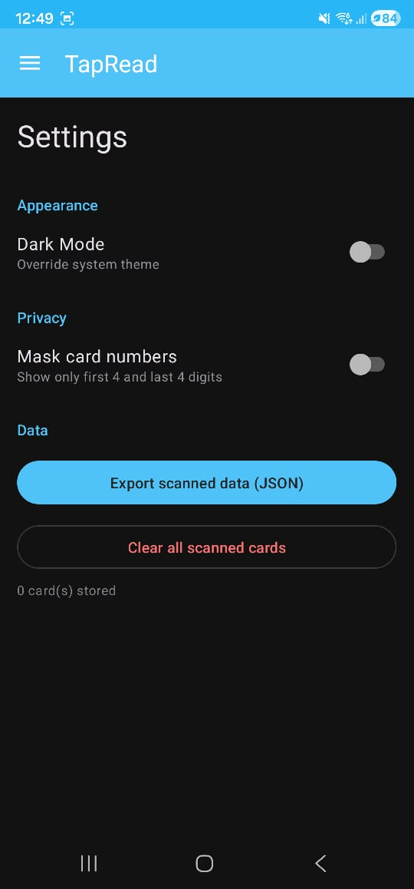
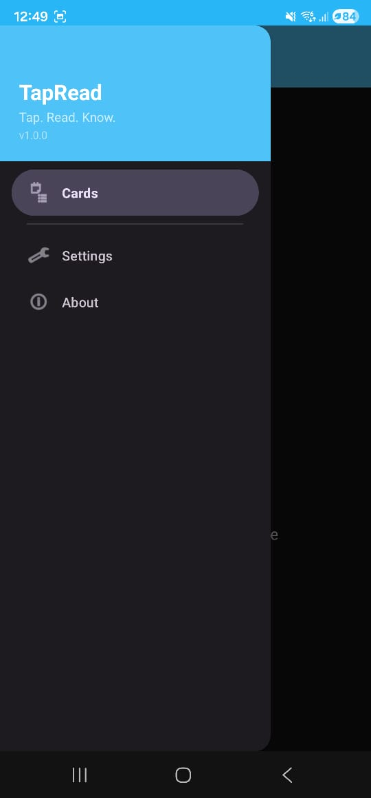

# TapRead

> **Tap. Read. Know.**
>
> An Android NFC reader for EMV contactless bank cards.
> Built for fintech professionals — POS sellers, terminal installers, payment gateway developers, NFC/RFID engineers, and anyone who's ever wondered what *actually* gets transmitted when you tap your card.
>
> This README is two things at once: project documentation and a complete A-to-Z reverse-engineering reference for how contactless EMV cards work. From the 13.56 MHz RF carrier all the way up to the parsed transaction history, every layer is explained — and every code path in the app is mapped back to the EMV spec that drives it.

Made with 💀 by [deadboy](https://github.com/deadboy18)

---

## Table of Contents

**Part I — Project**
1. [What It Does](#1-what-it-does)
2. [Features](#2-features)
3. [Screenshots](#3-screenshots)
4. [Supported Cards](#4-supported-cards)

**Part II — The Science**
5. [How a Contactless Card Actually Works (RF Physics)](#5-how-a-contactless-card-actually-works-rf-physics)
6. [The Protocol Stack — ISO 14443 → ISO 7816 → EMV](#6-the-protocol-stack)
7. [APDU Anatomy — Every Byte Explained](#7-apdu-anatomy)
8. [The EMV Application Hierarchy](#8-the-emv-application-hierarchy)
9. [BER-TLV — How the Chip Encodes Data](#9-ber-tlv-encoding)

**Part III — The Full Read Flow (matched to the code)**
10. [Step-by-Step Walkthrough with Real APDUs](#10-step-by-step-walkthrough)
11. [The Complete EMV Tag Dictionary](#11-the-complete-emv-tag-dictionary)
12. [Track 2 Decoded](#12-track-2-decoded)
13. [The Service Code (5F30)](#13-the-service-code-5f30)
14. [Cardholder Verification Method List (8E)](#14-cvm-list-decoded)
15. [Application Interchange Profile (82)](#15-application-interchange-profile-aip-decoded)
16. [Application Usage Control (9F07)](#16-application-usage-control-auc-decoded)
17. [Terminal & Card Transaction Qualifiers (9F66 / 9F6C)](#17-terminal--card-transaction-qualifiers-ttq--ctq)
18. [Application Cryptograms — TC, ARQC, AAC](#18-application-cryptograms--tc-arqc-aac)
19. [GENERATE AC — The Command You'll Never See in TapRead](#19-generate-ac--the-command-youll-never-see-in-tapread)
20. [Offline Data Authentication — The RSA Cert Chain](#20-offline-data-authentication--the-rsa-cert-chain)
21. [The 9F4F Trick — Transaction Time Extraction](#21-the-9f4f-trick--transaction-time-extraction)
22. [ATR, ATS, and CPLC — Identifying the Chip](#22-atr-ats-and-cplc)
23. [Historical Bytes — Decoding the ATS Payload](#23-historical-bytes--decoding-the-ats-payload)
24. [Scheme Detection Logic](#24-scheme-detection-logic)
25. [PAN, IIN/BIN, and Luhn — How Numbers Are Built](#25-pan-iinbin-and-luhn)
26. [Tokenized Wallet Detection](#26-tokenized-wallet-detection)
27. [EMV Payment Tokenisation — How DPANs Get Provisioned](#27-emv-payment-tokenisation--how-dpans-get-provisioned)
28. [Contactless-Disabled Card Detection](#28-contactless-disabled-card-detection)
29. [EMV Contactless Kernels — C-1 through C-8](#29-emv-contactless-kernels)
30. [Visa MSD vs qVSDC vs VSDC — Three Modes, One Card](#30-visa-msd-vs-qvsdc-vs-vsdc)
31. [Mastercard PayPass — MagStripe Mode vs M/Chip](#31-mastercard-paypass--magstripe-mode-vs-mchip)
32. [Relay Attacks — Why Contactless Has Distance-Bounding Now](#32-relay-attacks)
33. [Android HCE — The Other Side of the Conversation](#33-android-hce)

**Part IV — The Code**
34. [App Architecture](#34-app-architecture)
35. [The devnied Library Bridge](#35-the-devnied-library-bridge)
36. [File-by-File Code Walkthrough](#36-file-by-file-code-walkthrough)
37. [Threading, State, and Persistence](#37-threading-state-and-persistence)
38. [Reflection Tricks (Where & Why)](#38-reflection-tricks)
39. [Build & Install](#39-build--install)
40. [Project Structure](#40-project-structure)
41. [Dependencies](#41-dependencies)

**Part V — Security & Operations**
42. [Permissions & Privacy Model](#42-permissions--privacy-model)
43. [Security & Threat Model](#43-security--threat-model)
44. [Troubleshooting](#44-troubleshooting)
45. [Limitations](#45-limitations)
46. [Roadmap](#46-roadmap)
47. [References & Further Reading](#47-references--further-reading)
48. [Credits & License](#48-credits--license)

---

# Part I — Project

## 1. What It Does

Hold any contactless bank card against your phone. TapRead opens an ISO 14443 RF link, negotiates ISO-DEP transport, walks the EMV application discovery protocol per EMVCo Book B, reads every record the chip exposes, parses BER-TLV with a 60+ tag dictionary, and displays the result in three tabs:

- **CARD DETAIL** — Visual card face with scheme branding + all extracted EMV fields
- **TRANSACTIONS** — Recent contactless transactions with date, time, amount, currency, cryptogram
- **LOG** — Raw APDU command/response log with a parsed TLV tree

**No internet. No ads. No analytics. No background services. Everything stays on your device.**

The data TapRead reads is the same data your card transmits to every contactless POS terminal you tap at a store. No encryption is broken. No secrets are extracted. The card exposes this data by design — that's how EMV works.

---

## 2. Features

### Card Reading

- Reads Visa, Mastercard, Amex, JCB, UnionPay, Discover, RuPay, Maestro, CB, Dankort, Interac, and more
- Automatic scheme detection from AID prefix → app label → PAN range (three-tier fallback)
- Multi-application support (reads **all** AIDs on the chip, not just the highest-priority one)
- Contactless-disabled detection (PPSE returns SW1SW2 = `6A82` / `6985` → "NFC is locked on your card")
- Tokenized card detection (Apple Pay, Google Pay, Samsung Pay, Garmin, Fitbit, Huawei, Xiaomi)

### Data Extracted

| Data | Source | Notes |
|------|--------|-------|
| Card number (PAN) | Tag `5A` | Full or masked, copyable |
| Expiry date | Tag `5F24` | YYMMDD BCD → MM/YY |
| Cardholder name | Tag `5F20` | Often blank on modern cards |
| Track 1 data | Tag `56` | Raw hex |
| Track 2 equivalent | Tag `57` | Raw hex + parsed PAN/expiry/service code |
| Service code | Track 2 / Tag `5F30` | Decoded into human-readable string |
| All AIDs | Tag `4F` | Hex + label (`50`) + priority (`87`) |
| ATR/ATS | `IsoDep.historicalBytes` / `hiLayerResponse` | Chip platform ID |
| Card issuer (best-effort) | devnied ATR database | Pattern match against historical bytes |
| CPLC | Tag `9F7F` | IC fabricator, type, OS, manufacturer |
| CVM list | Tag `8E` | Decoded: PIN, signature, CDCVM, no CVM, fail-actions |
| Transaction log | `9F4D` (entry) + `9F4F` (format) | Date, time, amount, currency, country, cryptogram |
| Transaction time | Tag `9F21` via `9F4F` offset | Parsed manually because devnied doesn't expose it |
| NFC status | PPSE response SW | Active / Disabled / Blocked |
| Wallet type | Application labels | Physical card or tokenized |

### APDU Log

- Full command/response hex with color coding (green commands, blue responses)
- BER-TLV tree parsing with the [60-entry tag dictionary](#11-the-complete-emv-tag-dictionary)
- ASCII decoding where applicable (application labels, language preferences)
- Status word descriptions (`9000` → "Command OK", `6A82` → "File not found")
- Per-entry timestamps (`System.currentTimeMillis()` capture in `ApduLogger`)
- Shareable as text with the TLV tree included

### App Features

- **Navigation drawer** — Cards, Settings, About
- **Persistent storage** — Scanned cards survive app restarts (SharedPreferences + Gson, key `tapread_cards/scans`)
- **Mask PAN** — Toggle to show/hide middle digits (default ON)
- **Dark mode** — System default or manual toggle
- **Export JSON** — Share all stored card data via the Android share sheet
- **Copy buttons** — Copy PAN, copy extended details to clipboard
- **BIN Lookup** — Opens `bincheck.io` with the card's BIN pre-filled (in the browser, not in-app)
- **Haptic feedback** — Five patterns: `tick`, `pulse`, `success`, `error`, `posTerminal`, `heartbeat` (see `HapticUtil.kt`)
- **Reading dialog** — "Reading in progress… Please do not remove or move card"
- **NFC intent filter** — App appears in "Choose an action" when tapping a card outside the app
- **NFC status detection** — Prompts to enable NFC if disabled, warns if hardware missing

### Easter Eggs 🥚

- Tap the title on the About screen **7 times** → POS terminal beep pattern
- Shake your phone on the About screen → heartbeat haptic pattern

---

## 3. Screenshots

<p align="center">
  
  
  
</p>
<p align="center"><sub><b>Home — tap to scan</b> &nbsp;·&nbsp; <b>Card Detail</b> &nbsp;·&nbsp; <b>Extended Details</b></sub></p>

<p align="center">
  
  
  
</p>
<p align="center"><sub><b>Transactions (Dark)</b> &nbsp;·&nbsp; <b>Transactions (Light)</b> &nbsp;·&nbsp; <b>APDU Log + TLV Tree</b></sub></p>

<p align="center">
  
  
</p>
<p align="center"><sub><b>Settings</b> &nbsp;·&nbsp; <b>Navigation Drawer</b></sub></p>

---

## 4. Supported Cards

### Payment Schemes

Visa, Mastercard, American Express, JCB, UnionPay, Discover, Maestro, CB (France), Dankort (Denmark), CoGeBan (Italy), Banrisul (Brazil), SPAN (Saudi Arabia), Interac (Canada), RuPay (India), Verve (Nigeria), TROY (Turkey), MIR (Russia)

### Tokenized Wallets

Apple Pay, Google Pay, Samsung Pay, Garmin Pay, Fitbit Pay, Huawei Pay, Xiaomi Pay

### Contactless-Disabled Cards

Cards with NFC payment turned off in the bank app are detected and labeled with an orange warning banner.

---

# Part II — The Science

## 5. How a Contactless Card Actually Works (RF Physics)

Before any byte gets transmitted, there's physics.

### The Card Has No Battery

A contactless EMV card is a **passive device**. It contains:

- A loop antenna — typically 3–4 turns of etched or printed copper around the card's perimeter
- A microcontroller die bonded to the antenna (NXP, Infineon, Samsung, Renesas, or STMicroelectronics — see [CPLC fabricator codes](#20-atr-ats-and-cplc))
- No battery, no oscillator, no power source of any kind

The card is powered entirely by the magnetic field generated by your phone (or the POS terminal).

### Inductive Coupling at 13.56 MHz

When TapRead calls `nfcAdapter.enableReaderMode(...)`, Android tells the NFC controller to drive its antenna with an alternating current at **13.56 MHz** — an ISM (Industrial, Scientific, Medical) band reserved internationally for short-range RF.

The phone's antenna becomes an electromagnet. When the card enters the field (typically within 4 cm), the alternating magnetic flux passes through the card's antenna loop and **induces an alternating current in it** — exactly the same principle as a transformer, just with air instead of an iron core, and with both windings being a few millimeters apart.

That induced AC is rectified inside the chip's front-end to produce DC power. The chip boots. Boot time is typically 5–20 milliseconds.

### Load Modulation — How the Card Talks Back

The card has no transmitter — no battery, no oscillator. Instead, it uses **load modulation**:

1. The card briefly switches a load resistor across its antenna
2. The connected load draws more current from the magnetic field
3. The extra current draw is detectable at the phone's antenna as a tiny voltage dip
4. The phone reads the pattern of dips as the card's response

The modulation rides on a **subcarrier at 847.5 kHz** (13.56 MHz ÷ 16), giving a base bit rate of 106 kbit/s — scalable up to 848 kbit/s for faster cards.

Why this matters for TapRead: the load modulation signal is **very** weak (microvolts at the reader antenna), and any change in coupling distorts it. That's why the reading dialog explicitly says "Please do not remove or move card." Mid-read motion → `TagLostException` from `IsoDep.transceive()` → the app falls into the catch block in `EmvReader.read()` and surfaces an error.

### Coding (NFC-A vs NFC-B)

The two ISO 14443 flavors differ in how they encode bits over the RF link:

- **Type A (NFC-A)** — Modified Miller coding (reader → card) and Manchester coding (card → reader). Used by Mastercard, Visa, Amex, JCB, UnionPay contactless. Most common worldwide.
- **Type B (NFC-B)** — NRZ-L coding both ways, with BPSK subcarrier modulation card → reader. Used by some French CB cards and certain Asian schemes.

TapRead enables both — from `NfcDispatcher.kt`:

```kotlin
val flags = NfcAdapter.FLAG_READER_NFC_A or
        NfcAdapter.FLAG_READER_NFC_B or
        NfcAdapter.FLAG_READER_SKIP_NDEF_CHECK or
        NfcAdapter.FLAG_READER_NO_PLATFORM_SOUNDS
```

`SKIP_NDEF_CHECK` matters: without it, Android would try to interpret the tag as an NDEF data tag first, which is meaningless for an EMV card and slows the read. `NO_PLATFORM_SOUNDS` silences the OS-level NFC "blip" sound — TapRead uses its own haptic feedback instead.

### Anti-Collision

If two cards are in the field at once, both try to respond and their load modulations collide. The reader runs an **anti-collision algorithm** (ISO 14443-3): each card has a UID, the reader broadcasts bit-by-bit, and cards drop out of the conversation when their UID bit doesn't match. The surviving card is the one selected.

TapRead doesn't expose UID — Android's NFC stack singulates one card before invoking `ReaderCallback.onTagDiscovered(tag)`. If two cards are in your wallet, the chipset picks one and the other is ignored.

### Presence Check Delay

Android's NFC stack has a recurring "is the card still there?" check that runs **independently** of `IsoDep.transceive()` timeouts. On Broadcom-based chipsets and Android 13+, this check can fire mid-command and cause spurious disconnects. TapRead works around this in `NfcDispatcher.kt`:

```kotlin
val options = Bundle().apply {
    putInt(NfcAdapter.EXTRA_READER_PRESENCE_CHECK_DELAY, 250)
}
```

Bumping the check delay from the default 125 ms to 250 ms gives the card more time to complete each command before Android decides it's gone.

---

## 6. The Protocol Stack

Contactless EMV is layered. Each layer adds structure on top of the one below. TapRead writes to the top three layers; Android's NFC controller handles the bottom three.

```
┌─────────────────────────────────────────────────────────────┐
│  EMV (Books 1-4, A-D)   "SELECT PPSE", "READ RECORD", etc.  │  ← TapRead lives here
├─────────────────────────────────────────────────────────────┤
│  ISO 7816-4             APDU command/response structure     │
├─────────────────────────────────────────────────────────────┤
│  ISO-DEP (14443-4)      Block transmission, T=CL protocol   │
├─────────────────────────────────────────────────────────────┤
│  ISO 14443-3            Anti-collision, frame format        │  ← Android NFC stack
├─────────────────────────────────────────────────────────────┤
│  ISO 14443-2            Modulation, coding (Type A / B)     │
├─────────────────────────────────────────────────────────────┤
│  ISO 14443-1            Physical characteristics            │
└─────────────────────────────────────────────────────────────┘
```

### ISO-DEP — The Reliable Transport

ISO 14443-4 defines **ISO-DEP** (aka T=CL — "T equals contactless"), which provides:

- Reliable block transmission with CRC
- Chaining (for APDUs longer than the max frame size, which is typically 253 bytes for Android)
- Frame waiting time extension (so slow card operations don't time out)

Android exposes this via the `android.nfc.tech.IsoDep` class. Once `IsoDep.connect()` succeeds, you can call `transceive(byte[])` and get a byte array back. That's an APDU exchange — see [APDU Anatomy](#7-apdu-anatomy).

### How TapRead Gets to IsoDep

From `MainActivity.onTagDiscovered()` → `NfcDispatcher.getIsoDep(tag)`:

```kotlin
companion object {
    fun getIsoDep(tag: Tag): IsoDep? {
        return IsoDep.get(tag)
    }
}
```

`IsoDep.get()` returns `null` if the discovered tag doesn't speak ISO-DEP. That happens for MIFARE Classic, NTAG, FeliCa, and similar non-EMV cards. TapRead shows an "Unsupported card type" snackbar with the tag's UID and bails out.

---

## 7. APDU Anatomy

Every command TapRead sends to the card and every response it receives is an **APDU** — Application Protocol Data Unit. Defined by ISO 7816-4.

### Command APDU (C-APDU)

```
┌─────┬─────┬─────┬─────┬────┬──────────────┬────┐
│ CLA │ INS │ P1  │ P2  │ Lc │     Data     │ Le │
└─────┴─────┴─────┴─────┴────┴──────────────┴────┘
  1B    1B    1B    1B    1B    0–255 B       1B
```

| Field | Meaning |
|-------|---------|
| **CLA** | Class byte. `00` = ISO standard. `80` = proprietary. |
| **INS** | Instruction. `A4` = SELECT, `B2` = READ RECORD, `A8` = GET PROCESSING OPTIONS, `CA` = GET DATA, `AE` = GENERATE AC. |
| **P1, P2** | Parameters. Meaning depends on INS. |
| **Lc** | Length of the Data field. Omitted if no Data. |
| **Data** | Command-specific payload. |
| **Le** | Length expected in response. `00` = "send me up to 256 bytes". |

The **four "Cases"** of an APDU structure:

- **Case 1**: CLA INS P1 P2 (no data, no expected response data)
- **Case 2**: CLA INS P1 P2 Le (no data, response expected)
- **Case 3**: CLA INS P1 P2 Lc Data (data sent, no response data)
- **Case 4**: CLA INS P1 P2 Lc Data Le (data sent, response data expected) ← most EMV commands

TapRead labels the INS byte for the log via `IsoDepProvider.guessCommandLabel()`:

```kotlin
private fun guessCommandLabel(cmd: ByteArray): String {
    if (cmd.size < 4) return "UNKNOWN"
    val ins = cmd[1].toInt() and 0xFF
    return when (ins) {
        0xA4 -> "SELECT"
        0xB2 -> "READ RECORD"
        0xCA -> "GET DATA"
        0xA8 -> "GET PROCESSING OPTIONS"
        0x88 -> "INTERNAL AUTHENTICATE"
        0x82 -> "EXTERNAL AUTHENTICATE"
        0x84 -> "GET CHALLENGE"
        else -> "INS ${HexUtil.toHex(byteArrayOf(cmd[1]))}"
    }
}
```

### Response APDU (R-APDU)

```
┌──────────────┬─────┬─────┐
│   Data       │ SW1 │ SW2 │
└──────────────┴─────┴─────┘
   0–256 B       1B    1B
```

The last two bytes are always the **Status Word** (SW1SW2).

### The Full Status Word Table (EMV-relevant)

| SW1SW2 | Meaning |
|--------|---------|
| `9000` | Command OK |
| `6100`–`61FF` | More data available — use GET RESPONSE with Le = SW2 |
| `6200`–`62FF` | Warning, response data may be incorrect but is returned |
| `6283` | Selected file invalidated |
| `6300` | No information given (warning) |
| `63CX` | Counter (X is the counter value) |
| `6700` | Wrong length |
| `6800` | No information given (functions in CLA not supported) |
| `6881` | Logical channel not supported |
| `6882` | Secure messaging not supported |
| `6900` | No information given (command not allowed) |
| `6981` | Command incompatible with file structure |
| `6982` | Security status not satisfied |
| `6983` | Authentication method blocked |
| `6984` | Reference data invalidated |
| `6985` | Conditions of use not satisfied ← contactless blocked |
| `6986` | Command not allowed (no current EF) |
| `6A00` | No information given (wrong parameters) |
| `6A80` | Incorrect parameters in the data field |
| `6A81` | Function not supported |
| `6A82` | File or application not found ← no payment app on contactless interface |
| `6A83` | Record not found |
| `6A86` | Incorrect P1/P2 |
| `6A88` | Referenced data not found ← common for GET DATA on missing tag |
| `6B00` | Wrong parameters (offset outside EF) |
| `6CXX` | Wrong Le field; SW2 indicates the exact length |
| `6D00` | Instruction not supported or invalid |
| `6E00` | Class not supported |
| `6F00` | No precise diagnosis |

TapRead's `EmvReader.detectContactlessStatus()` specifically watches for `6A82` and `6985` on the SELECT command:

```kotlin
private fun detectContactlessStatus(logger: ApduLogger): ContactlessStatus {
    for (entry in logger.entries) {
        if (entry.label == "SELECT" && entry.response.size >= 2) {
            val sw = ((entry.response[entry.response.size - 2].toInt() and 0xFF) shl 8) or
                    (entry.response[entry.response.size - 1].toInt() and 0xFF)
            return when (sw) {
                0x6A82 -> ContactlessStatus.DISABLED
                0x6985 -> ContactlessStatus.BLOCKED
                else -> ContactlessStatus.ACTIVE
            }
        }
    }
    return ContactlessStatus.ACTIVE
}
```

---

## 8. The EMV Application Hierarchy

Every EMV card is structured as a tree of **applications**, where each application has its own data file system. Here's the model:

```
┌─────────────────────────────────────────────────┐
│   CARD                                          │
│   ├── Master File (MF)                          │
│   ├── PSE/PPSE Directory                        │
│   │   "2PAY.SYS.DDF01" (contactless)            │
│   │   "1PAY.SYS.DDF01" (contact)                │
│   │   └── List of installed payment apps        │
│   └── Application 1 (e.g. Visa Debit)           │
│       ├── AID: A0000000031010                   │
│       ├── Label: "VISA DEBIT"                   │
│       ├── EF (SFI 1) Record 1 → PAN, expiry...  │
│       ├── EF (SFI 2) Record 1 → CVM list...     │
│       ├── EF (SFI 11) Records 1-10 → Tx log     │
│       └── PDOL, CDOL1, CDOL2                    │
│   └── Application 2 (e.g. US Common Debit)      │
│       └── ...                                   │
└─────────────────────────────────────────────────┘
```

A few things to note:

- **PPSE** ("Proximity Payment System Environment") is the contactless equivalent of PSE. Every contactless card has it under the DF name `2PAY.SYS.DDF01`.
- **AID** (Application Identifier) is up to 16 bytes. The first 5 bytes (the **RID** — Registered Application Provider Identifier) identify the scheme; the rest identifies the product.
- **EF** (Elementary File) is identified by an **SFI** (Short File Identifier, 1–30). Each EF holds one or more **records**, addressable by record number.
- **PDOL** (Processing Options Data Object List) tells the terminal what data to provide in GPO.
- **CDOL1/CDOL2** (Card Risk Management Data Object List) tells the terminal what data to provide for GENERATE AC.

---

## 9. BER-TLV Encoding

Everything the card returns is **BER-TLV**: Basic Encoding Rules — Tag, Length, Value. It's a recursive binary format defined in ISO/IEC 8825-1. Every byte TapRead's `TlvParser.kt` parses follows these rules.

### Tag

Tags are 1 or 2 bytes:

- **1-byte tag**: First byte's low 5 bits are NOT all set. e.g. `5A`, `50`, `87`, `94`.
- **2-byte tag**: First byte's low 5 bits are all set (`xxx11111`). Second byte continues. e.g. `5F20`, `9F02`, `9F4F`.

From `TlvParser.kt`:

```kotlin
val tagByte = hex.substring(pos, pos + 2).toInt(16)
val tag: String
if ((tagByte and 0x1F) == 0x1F) {
    // Multi-byte tag
    if (pos + 4 > hex.length) break
    tag = hex.substring(pos, pos + 4)
    pos += 4
} else {
    tag = hex.substring(pos, pos + 2)
    pos += 2
}
```

The **top 3 bits** of the first byte encode metadata:

| Bits 8-7 | Class |
|----------|-------|
| `00` | Universal |
| `01` | Application class (`4F`, `50`, `5A`) |
| `10` | Context-specific (`70`, `77`, `80`–`9F`, `A5`, `BF`) |
| `11` | Private |

| Bit 6 | Form |
|-------|------|
| `0` | **Primitive** — the value is raw data |
| `1` | **Constructed** — the value is itself more TLV (nested) |

Examples:
- `5A` = `0101 1010` → application class, primitive → PAN, raw BCD
- `70` = `0111 0000` → application class, constructed → contains nested TLVs
- `9F02` → context-specific, primitive (bit 6 of first byte = 0), multi-byte

TapRead detects constructed tags this way:

```kotlin
val isConstructed = (tag.substring(0, 2).toInt(16) and 0x20) != 0
```

Bit position 6 (counting from 1) = bit mask `0x20`.

### Length

Lengths come in three forms (TapRead handles all three):

| First byte | Meaning | Code path |
|------------|---------|-----------|
| `00`–`7F` | Length is this byte directly (0–127) | `length = lenByte; pos += 2` |
| `81 XX` | Length is the next 1 byte (128–255) | `length = ...substring(...).toInt(16); pos += 4` |
| `82 XX XX` | Length is the next 2 bytes (256–65535) | `length = ...substring(...).toInt(16); pos += 6` |
| `83 XX XX XX` | Length is the next 3 bytes (rare) | Not handled — would break (intentional, EMV doesn't use it) |

### Value

Just `length` bytes of raw data. Interpretation depends on the tag — see the [dictionary](#11-the-complete-emv-tag-dictionary).

### Walking the Tree

TapRead's parser is a recursive descent. Pseudocode:

```
function parse(bytes):
    while bytes remaining:
        tag = readTag(bytes)         // 1 or 2 bytes
        length = readLength(bytes)   // 1, 2, or 3 bytes
        value = bytes[next length]
        if tag is constructed:
            children = parse(value)
            emit Node(tag, children)
        else:
            emit Leaf(tag, value)
```

That's the whole binary EMV world, in ~50 lines of Kotlin (`TlvParser.parseNodes`).

---

# Part III — The Full Read Flow

## 10. Step-by-Step Walkthrough

Here's the exact sequence TapRead executes against the card. Every byte is real EMV. Code paths are cited.

### Step 0 — Tag Discovery

When you tap a card, Android's NFC controller does the ISO 14443 anti-collision and ISO 14443-4 RATS exchange. The result is delivered to `ReaderCallback` in `NfcDispatcher.kt`:

```kotlin
private val readerCallback = NfcAdapter.ReaderCallback { tag ->
    log.info("Tag discovered: {}", tag.techList?.joinToString())
    onTagDiscovered(tag)
}
```

That callback hops to `MainActivity.onTagDiscovered(tag)`, which extracts `IsoDep.get(tag)`. If it's null, the tag isn't EMV — snackbar + bail. If it's not null, TapRead vibrates (`HapticUtil.pulse()`), shows the reading dialog, and launches a coroutine on `Dispatchers.IO`:

```kotlin
scope.launch {
    val result = withContext(Dispatchers.IO) { emvReader.read(isoDep) }
    ...
}
```

### Step 1 — Connect

In `EmvReader.read()`:

```kotlin
isoDep.connect()
isoDep.timeout = 5000
provider.setTagCom(isoDep)
```

Now you have a live ISO-DEP channel. Behind the scenes, the controller has already done anti-collision and RATS, and the historical bytes of the ATS are available via `isoDep.historicalBytes`. The 5-second timeout applies to each `transceive()` call.

TapRead then hands the IsoDep to the devnied library via `IProvider`:

```kotlin
val config = EmvTemplate.Config()
    .setContactLess(true)
    .setReadAllAids(true)
    .setReadTransactions(true)
    .setReadCplc(true)
    .setRemoveDefaultParsers(false)
    .setReadAt(true)

val template = EmvTemplate.Builder()
    .setProvider(provider)
    .setConfig(config)
    .build()

val emvCard: EmvCard = template.readEmvCard()
```

From this point, devnied drives the conversation. TapRead's `IsoDepProvider` is the bridge, and every APDU exchange is captured by `ApduLogger`.

### Step 2 — SELECT PPSE

The first command devnied sends:

```
→ Command:  00 A4 04 00 0E 32 50 41 59 2E 53 59 53 2E 44 44 46 30 31 00
            │  │  │  │  │  └──────────────────────────────────────┘  └─ Le = 00 ("give me everything")
            │  │  │  │  │     "2PAY.SYS.DDF01" in ASCII
            │  │  │  │  └─ Lc = 14 bytes (0x0E)
            │  │  │  └─ P2 = 00 (first occurrence)
            │  │  └─ P1 = 04 (select by DF name)
            │  └─ INS = A4 (SELECT)
            └─ CLA = 00 (ISO)
```

`2PAY.SYS.DDF01` is the universal "directory" application defined by EMV Book B. Every contactless card supports it. It's the card's table of contents.

```
← Response: 6F XX 84 0E 32 50 41 59 2E 53 59 53 2E 44 44 46 30 31 A5 XX
            BF 0C XX 61 XX 4F XX <AID-bytes> 50 XX <label-bytes> 87 01 <priority>
            61 XX 4F XX <AID-bytes> 50 XX <label-bytes> 87 01 <priority>
            ...
            90 00
```

Structure (constructed templates marked with `*`):

- `6F` * — File Control Information (FCI) template
  - `84` — DF Name (echoes back the PPSE name)
  - `A5` * — FCI Proprietary template
    - `BF0C` * — FCI Issuer Discretionary Data
      - `61` * — Application Template (one per app on the card)
        - `4F` — **AID**
        - `50` — Application Label ("VISA DEBIT", "MASTERCARD", etc.)
        - `87` — Application Priority Indicator

A typical dual-AID Visa debit card returns something like:

```
4F 07 A0000000031010  →  Visa Credit/Debit (international AID)
50 0A "VISA DEBIT"
87 01 01

4F 07 A0000000980840  →  US Common Debit AID
50 0F "US COMMON DEBIT"
87 01 02
```

### Step 3 — SELECT AID

For each AID returned by PPSE, devnied sends a SELECT to activate that application:

```
→ Command:  00 A4 04 00 07 A0 00 00 00 03 10 10 00
                              └────────────────┘
                              Visa international AID
```

Response:

```
← Response: 6F XX 84 07 A0 00 00 00 03 10 10
            A5 XX 50 <label> 87 01 <priority>
            9F38 XX <PDOL>          ← Processing Options Data Object List
            BF0C XX <FCI issuer data>
            90 00
```

The critical new tag is **`9F38` — PDOL**. It tells you what data the card needs from the terminal before it'll cough up its processing options.

A typical Visa contactless PDOL: `9F66 04 9F02 06 9F03 06 9F1A 02 95 05 5F2A 02 9A 03 9C 01 9F37 04`

Parsed:

| Tag | Length | Meaning |
|-----|--------|---------|
| `9F66` | 4 | Terminal Transaction Qualifiers (TTQ) — see §17 |
| `9F02` | 6 | Amount Authorized |
| `9F03` | 6 | Amount Other |
| `9F1A` | 2 | Terminal Country Code |
| `95`   | 5 | Terminal Verification Results |
| `5F2A` | 2 | Transaction Currency Code |
| `9A`   | 3 | Transaction Date |
| `9C`   | 1 | Transaction Type |
| `9F37` | 4 | Unpredictable Number |

For pure data reading (no transaction), devnied fills these with safe defaults — usually zeros or library-defined constants. The TTQ is typically set to declare "online cryptogram required, no CVM" so the card stays in a simple flow.

### Step 4 — GET PROCESSING OPTIONS (GPO)

```
→ Command:  80 A8 00 00 <Lc> 83 <PDOL-data-length> <PDOL-data> 00
            │  │  │  │       │
            │  │  │  │       └─ Tag 83 wraps the PDOL data
            │  │  │  └─ P2 = 00
            │  │  └─ P1 = 00
            │  └─ INS = A8 (GPO)
            └─ CLA = 80 (proprietary EMV)
```

The card responds in one of two formats:

**Format 1 (legacy, fixed binary):**
```
80 XX <AIP (2B)> <AFL (variable)>
```

**Format 2 (BER-TLV, modern):**
```
77 XX 82 02 <AIP> 94 XX <AFL> [other tags like 9F36, 9F26 for fast-path]
```

The two fields that matter:

- **`82` AIP** — Application Interchange Profile (2 bytes of bit flags — see §15)
- **`94` AFL** — Application File Locator (the map of records to read)

### Step 5 — Parse the AFL

The AFL is the key to everything. It's a list of **4-byte entries**:

```
┌────────┬───────────────┬─────────────┬──────────────────────┐
│  SFI   │ First record  │ Last record │  Records used for    │
│  << 3  │               │             │  offline auth        │
└────────┴───────────────┴─────────────┴──────────────────────┘
  Byte 0     Byte 1         Byte 2         Byte 3
```

- **SFI (Short File Identifier)**: The upper 5 bits of byte 0. Values 1–30 are valid file IDs.
- **First/Last record**: The range of records in that file to read.
- **Auth count**: How many of those records go into the offline data authentication hash.

A real-world AFL: `08 01 03 00 10 01 01 00 18 01 02 00`

Decoded:

| Entry | SFI byte | SFI (>>3) | First | Last | Auth |
|-------|----------|-----------|-------|------|------|
| 1 | `08` (`0000 1000`) | 1 | 1 | 3 | 0 |
| 2 | `10` (`0001 0000`) | 2 | 1 | 1 | 0 |
| 3 | `18` (`0001 1000`) | 3 | 1 | 2 | 0 |

→ 6 records to read total.

### Step 6 — READ RECORD (loop)

For each (SFI, record number) pair from the AFL:

```
→ Command:  00 B2 <record> <P2> 00
                            │
                            └─ P2 = (SFI << 3) | 04
                               The "| 04" tells the card "find by SFI, not curr EF"
```

Example for SFI=2, record=1:

```
→ Command:  00 B2 01 14 00
                     │
                     └─ 0x14 = (2 << 3) | 4 = 0x10 | 0x04
```

The response is a `70` template (Application Elementary File data template) containing all the EMV data tags for that record:

```
← Response: 70 XX
              5A 08 <PAN>
              5F24 03 <expiry YYMMDD>
              5F20 XX <cardholder name>
              57 XX <Track 2 equivalent>
              5F30 02 <service code>
              8C XX <CDOL1>
              8D XX <CDOL2>
              8E XX <CVM list>
              9F07 02 <Application Usage Control>      ← see §16
              9F08 02 <Application Version Number>
              9F0D 05 <Issuer Action Code - Default>
              9F0E 05 <Issuer Action Code - Denial>
              9F0F 05 <Issuer Action Code - Online>
              5F28 02 <Issuer Country Code>
              5F34 01 <PAN Sequence Number>
              9F1F XX <Track 1 Discretionary Data>
              9F4A 01 <Static Data Authentication Tag List>
              ...
            90 00
```

devnied passes each response into its TLV parser; TapRead also captures the raw bytes via `ApduLogger` for the in-app log view.

### Step 7 — Read Transaction Log (if present)

Tag **`9F4D`** is the **Log Entry**. If it appeared in any prior response, it tells you:

- Byte 1: SFI of the transaction log
- Byte 2: Number of log records

Tag **`9F4F`** is the **Log Format** — the schema of each log record. The whole "extract transaction time" mechanism revolves around this — see §21.

TapRead then loops READ RECORD against the log SFI to pull the actual transactions.

### Step 8 — CPLC (Optional)

TapRead also tries to fetch the Card Production Life Cycle:

```
→ Command:  80 CA 9F 7F 00
            │  │  └──┘  └─ Le = 0
            │  │   └─ P1P2 = 9F7F (the requested tag)
            │  └─ INS = CA (GET DATA)
            └─ CLA = 80
```

Not every card responds — some return `6A88` (Referenced data not found). TapRead extracts CPLC via reflection on the devnied `EmvCard.cplc` field — see §22.

### Step 9 — Close

```kotlin
finally {
    try { isoDep.close() } catch (_: Exception) {}
}
```

The RF link drops. The card loses power. The whole thing took ~200–800 ms depending on the card and how many records were read.

---

## 11. The Complete EMV Tag Dictionary

The 60-entry dictionary from `TlvParser.kt`'s `EMV_TAGS` map, organized for human readers. Tags marked **\*** are constructed (contain nested TLVs).

### Application Discovery & FCI

| Tag | Name | Format |
|-----|------|--------|
| `6F` * | FCI Template | Constructed |
| `84` | Dedicated File (DF) Name | Variable |
| `A5` * | FCI Proprietary Template | Constructed |
| `BF0C` * | FCI Issuer Discretionary Data | Constructed |
| `61` * | Application Template | Constructed |
| `4F` | Application Identifier (AID) | 5–16 bytes |
| `50` | Application Label | ASCII |
| `87` | Application Priority Indicator | 1 byte |
| `9F12` | Application Preferred Name | ASCII |
| `9F11` | Issuer Code Table Index | 1 byte |
| `9F38` | PDOL (Processing Data Object List) | Variable |

### Record Templates

| Tag | Name |
|-----|------|
| `70` * | EMV Record Template (response to READ RECORD) |
| `77` * | Response Template Format 2 (TLV) |
| `80` | Response Template Format 1 (fixed) |

### Primary Account Data

| Tag | Name | Format |
|-----|------|--------|
| `5A` | Application PAN | BCD, up to 19 digits |
| `5F20` | Cardholder Name | ASCII, padded with spaces, up to 26 chars |
| `5F24` | Application Expiration Date | YYMMDD BCD |
| `5F25` | Application Effective Date | YYMMDD BCD |
| `5F28` | Issuer Country Code | 2-digit BCD, ISO 3166 |
| `5F2A` | Transaction Currency Code | ISO 4217 numeric |
| `5F2D` | Language Preference | ASCII, up to 8 chars |
| `5F34` | PAN Sequence Number | 1 byte BCD |

### Track Data

| Tag | Name |
|-----|------|
| `56` | Track 1 Data |
| `57` | Track 2 Equivalent Data |
| `9F1F` | Track 1 Discretionary Data |
| `9F20` | Track 2 Discretionary Data |

### GPO / Processing

| Tag | Name |
|-----|------|
| `82` | Application Interchange Profile (AIP) |
| `94` | Application File Locator (AFL) |
| `8C` | CDOL1 (Card Risk Mgmt Data Object List 1) |
| `8D` | CDOL2 (Card Risk Mgmt Data Object List 2) |
| `8E` | CVM List |

### Risk Management

| Tag | Name |
|-----|------|
| `9F07` | Application Usage Control |
| `9F08` | Application Version Number (card) |
| `9F09` | Application Version Number (terminal) |
| `9F0D` | Issuer Action Code – Default |
| `9F0E` | Issuer Action Code – Denial |
| `9F0F` | Issuer Action Code – Online |
| `9F10` | Issuer Application Data |

### Transaction / Cryptogram

| Tag | Name |
|-----|------|
| `9A` | Transaction Date |
| `9C` | Transaction Type |
| `9F02` | Amount, Authorized |
| `9F03` | Amount, Other |
| `9F1A` | Terminal Country Code |
| `9F21` | Transaction Time |
| `9F26` | Application Cryptogram |
| `9F27` | Cryptogram Information Data |
| `9F33` | Terminal Capabilities |
| `9F34` | CVM Results |
| `9F35` | Terminal Type |
| `9F36` | Application Transaction Counter (ATC) |
| `9F37` | Unpredictable Number |
| `9F42` | Application Currency Code |
| `9F44` | Application Currency Exponent |

### Offline Data Authentication

| Tag | Name |
|-----|------|
| `9F45` | Data Authentication Code |
| `9F46` | ICC Public Key Certificate |
| `9F47` | ICC Public Key Exponent |
| `9F48` | ICC Public Key Remainder |
| `9F49` | DDOL (Dynamic Data Object List) |
| `9F4A` | Static Data Authentication Tag List |

### Contactless-Specific

| Tag | Name |
|-----|------|
| `9F4D` | Log Entry |
| `9F4F` | Log Format |
| `9F66` | Terminal Transaction Qualifiers (TTQ) — Visa |
| `9F6C` | Card Transaction Qualifiers (CTQ) — Visa |
| `9F6E` | Form Factor Indicator / Third-Party Data |
| `9F7C` | Customer Exclusive Data |
| `9F7F` | Card Production Life Cycle (CPLC) |

---

## 12. Track 2 Decoded

Tag `57` — Track 2 Equivalent — is the single most useful field on a contactless card. It packs the magstripe equivalent of the same card into one tidy nibble-aligned binary blob:

```
<PAN> D <expiry YYMM> <service code> <discretionary data> [F (pad)]
```

The `D` is the field separator (hex `D`, nibble-aligned), and the optional `F` is a padding nibble if the total nibble count is odd.

Example raw Track 2 (hex): `4111111111111111D2512201F123456789F`

Decoded by reading nibble-by-nibble until the `D`:

- PAN: `4111111111111111` (16 digits)
- Separator: `D`
- Expiry: `2512` (YYMM) → December 2025
- Service code: `201` (see §13)
- Discretionary data: `F123456789` (variable; issuer-specific, often contains PIN verification value, CVV equivalent)
- Trailing `F` is the odd-nibble pad

TapRead extracts the raw Track 2 bytes via reflection (the devnied library wraps it in a `Track2` object):

```kotlin
private fun extractTrack2(card: EmvCard): String? {
    return try {
        val t = card.track2 ?: return null
        val f = t.javaClass.getDeclaredField("raw"); f.isAccessible = true
        (f.get(t) as? ByteArray)?.let { HexUtil.toHexSpaced(it) }
    } catch (_: Exception) {
        try { card.track2?.toString() } catch (_: Exception) { null }
    }
}
```

The result is displayed as space-separated hex in the UI.

---

## 13. The Service Code (5F30)

The 3-digit service code in Track 2 (also separately stored in tag `5F30`) is one of the most under-documented but most useful fields. Each digit means something different.

From `TlvParser.decodeServiceCode()`:

### Digit 1 — Interchange and Technology

| Value | Meaning |
|-------|---------|
| `1` | International interchange OK |
| `2` | International interchange + IC chip required |
| `5` | National interchange only |
| `6` | National interchange + IC chip required |
| `7` | Private use / no interchange except bilateral agreement |
| `9` | Test card |

### Digit 2 — Authorization Processing

| Value | Meaning |
|-------|---------|
| `0` | Normal authorization |
| `2` | Contact issuer for every transaction (online-only) |
| `4` | Contact issuer except under bilateral agreement |

### Digit 3 — Range of Services / CVM

| Value | Meaning |
|-------|---------|
| `0` | No restrictions, PIN required |
| `1` | No restrictions |
| `2` | Goods and services only |
| `3` | ATM only, PIN required |
| `4` | Cash only |
| `5` | Goods and services only, PIN required |
| `6` | No restrictions, PIN prompting if PIN pad present |
| `7` | Goods and services only, PIN prompting |

A service code of **`201`** therefore decodes as:
- "International + IC chip"
- "Normal authorization"
- "No restrictions"

Which is a common configuration for international chip + contactless debit cards.

---

## 14. CVM List Decoded

Tag `8E` — Cardholder Verification Method List. This is how the card tells the terminal which verification methods are acceptable, and in what order. TapRead decodes it in `TlvParser.decodeCvmList()`.

### Structure

```
┌──────────────────┬──────────────────┬─────────────────────┐
│ Amount X (4B)    │ Amount Y (4B)    │  CV Rules (n × 2B)  │
└──────────────────┴──────────────────┴─────────────────────┘
```

The two amounts are reference thresholds in the smallest currency unit used by the CV rules below (used by conditions `06`–`09`).

Each **CV Rule** is 2 bytes:

#### Byte 1 — Method byte

```
┌─┬─┬─┬─┬─┬─┬─┬─┐
│0│X│M M M M M M│
└─┴─┴─┴─┴─┴─┴─┴─┘
   │ └──┬───────┘
   │    └─ CVM Code (bits 6-1)
   └─ Apply succeeding CVM if this one fails? (bit 7)
```

Bit 7 (the `X`):
- `0` = Fail CVM processing if this method fails
- `1` = Apply succeeding CV Rule if this fails

CVM Codes (the low 6 bits, from `TlvParser.kt`):

| Code (hex) | Method |
|------------|--------|
| `00` | Fail CVM processing |
| `01` | Plaintext PIN verified by ICC |
| `02` | Enciphered PIN verified online |
| `03` | Plaintext PIN by ICC + signature |
| `04` | Enciphered PIN verified by ICC |
| `05` | Enciphered PIN by ICC + signature |
| `1E` | Signature |
| `1F` | No CVM required |
| `20` | CDCVM (on-device CVM — used by mobile wallets) |

#### Byte 2 — Condition byte

When does this rule apply? From `TlvParser.kt`:

| Code (hex) | Condition |
|------------|-----------|
| `00` | Always |
| `01` | If unattended cash |
| `02` | If not unattended cash or manual |
| `03` | If terminal supports the CVM |
| `06` | If amount under X |
| `07` | If amount over X |
| `08` | If amount under Y |
| `09` | If amount over Y |

So when you see a CVM list like:

```
00 00 00 00  00 00 00 00  1F 03 1F 00
└─ X = 0 ─┘  └─ Y = 0 ─┘  └R1┘  └R2┘
```

Decoded:
- Rule 1: `1F 03` = "No CVM required" if terminal supports it
- Rule 2: `1F 00` = "No CVM required" always

That's a typical no-CVM-required contactless card for low-value transactions.

A CDCVM card (Apple Pay, Google Pay) typically shows:

```
... 42 03 1E 03 1F 00
    │     │     │
    │     │     └─ Fallback: no CVM, always
    │     └─ Fallback 2: signature, if terminal supports
    └─ Method 0x42 = 0x40 (apply next if fail) | 0x02 (enciphered PIN online)
```

Note the high bit `0x40` set on the method byte = "if this fails, try the next rule".

---

## 15. Application Interchange Profile (AIP) Decoded

Tag `82` — 2 bytes, **the** capability bitmap of the card application. Returned in the GPO response. TapRead displays the raw value; here's the full decode for reference.

### Byte 1

| Bit | Meaning if set |
|-----|----------------|
| 8 | RFU |
| 7 | **SDA** supported (Static Data Authentication) |
| 6 | **DDA** supported (Dynamic Data Authentication) |
| 5 | Cardholder verification is supported |
| 4 | Terminal risk management is to be performed |
| 3 | Issuer authentication is supported |
| 2 | On-device cardholder verification supported (CDCVM) |
| 1 | **CDA** supported (Combined Dynamic Data Authentication / Generate AC) |

### Byte 2

| Bit | Meaning if set |
|-----|----------------|
| 8 | EMV mode supported (contactless) |
| 7–1 | RFU (some kernels use these for scheme-specific flags) |

So an AIP of `7C 00`:

```
0111 1100  0000 0000
 ││││││ │     reserved
 ││││││ └─ Cardholder verification supported
 │││││└─ Terminal risk mgmt to be performed
 ││││└─ Issuer auth supported
 │││└─ CDCVM supported
 ││└─ CDA supported
 │└─ DDA supported
 └─ SDA supported (here = 1, supports SDA)
```

→ Card supports SDA, DDA, CV, terminal risk mgmt, issuer auth, CDCVM, and CDA — a fully-featured modern chip card.

### How a Terminal Picks an ODA Method

The priority is **CDA > DDA > SDA**:

- If both card and terminal support CDA → CDA is performed
- Else if both support DDA → DDA is performed
- Else if both support SDA → SDA is performed
- Else → "ODA not performed" bit in TVR (`95`) is set

CDA is strongest because it binds the dynamic signature to the application cryptogram itself, making relay attacks much harder.

---

## 16. Application Usage Control (AUC) Decoded

Tag `9F07` — 2 bytes — the issuer's restrictions on where and how the card can be used.

### Byte 1

| Bit | Meaning if set |
|-----|----------------|
| 8 | Valid for domestic cash transactions |
| 7 | Valid for international cash transactions |
| 6 | Valid for domestic goods |
| 5 | Valid for international goods |
| 4 | Valid for domestic services |
| 3 | Valid for international services |
| 2 | Valid at ATMs |
| 1 | Valid at terminals other than ATMs |

### Byte 2

| Bit | Meaning if set |
|-----|----------------|
| 8 | Domestic cashback allowed |
| 7 | International cashback allowed |
| 6–1 | RFU |

So `9F07 = FF00`:

- `FF` = all bits of byte 1 set → valid everywhere, all transaction types, ATMs + POS
- `00` = no cashback bits set

That's a typical unrestricted credit card.

A "domestic only, POS only" card might be `9F07 = A8 00`:

- `1010 1000`
- Bit 8: domestic cash ✓
- Bit 6: domestic goods ✓
- Bit 4: domestic services ✓
- Bit 2: at ATMs ✓ (note: this is needed for the card to work at all if it has restrictions)
- Bit 1: at non-ATM terminals ✓

The card uses AUC to refuse transactions outside its allowed scope before even generating a cryptogram.

---

## 17. Terminal & Card Transaction Qualifiers (TTQ & CTQ)

Two Visa-defined contactless tags (also used by other schemes in equivalent kernels). Both are 4-byte (TTQ) and 2-byte (CTQ) bit arrays that negotiate how a contactless transaction will be processed.

### TTQ — Tag 9F66, 4 bytes (terminal → card via PDOL)

#### Byte 1

| Bit | Meaning if set |
|-----|----------------|
| 8 | Contactless MSD supported (Magnetic Stripe Data emulation, legacy) |
| 7 | Contactless VSDC supported (full EMV contactless) |
| 6 | Contactless qVSDC supported (Visa quick chip) |
| 5 | Contact chip supported |
| 4 | Offline-only reader |
| 3 | Online PIN supported |
| 2 | Signature supported |
| 1 | ODA for Online Authorizations supported |

#### Byte 2

| Bit | Meaning if set |
|-----|----------------|
| 8 | Online cryptogram required |
| 7 | CVM required |
| 6 | Contact chip offline PIN supported |
| 5–1 | RFU |

#### Byte 3

| Bit | Meaning if set |
|-----|----------------|
| 8 | Issuer Update Processing supported |
| 7 | Mobile functionality supported (Consumer Device CVM) |
| 6–1 | RFU |

#### Byte 4

All RFU.

### CTQ — Tag 9F6C, 2 bytes (card → terminal in GPO response)

#### Byte 1

| Bit | Meaning if set |
|-----|----------------|
| 8 | Online PIN required |
| 7 | Signature required |
| 6 | Go online if offline authentication fails and reader is online-capable |
| 5 | Switch interface if offline authentication fails and reader supports VIS |
| 4 | Go online if AAC was generated (decline) |
| 3 | Switch interface for cash transactions |
| 2 | Switch interface for cashback transactions |
| 1 | RFU |

#### Byte 2

| Bit | Meaning if set |
|-----|----------------|
| 8 | Consumer Device CVM performed |
| 7 | Card supports Issuer Update Processing at POS |
| 6–1 | RFU |

The interaction: terminal advertises capabilities via TTQ → card responds with CTQ that *overrides* or refines TTQ based on transaction context (amount, merchant category, card profile).

---

## 18. Application Cryptograms — TC, ARQC, AAC

When a real POS terminal completes a transaction, it sends a **GENERATE AC** command to the card. The card responds with an 8-byte cryptogram (tag `9F26`) and a 1-byte type indicator (tag `9F27`).

TapRead does **not** issue GENERATE AC — it's a read-only tool. But the transaction log on the card stores past cryptograms, which TapRead surfaces. Here's what they mean.

### The Three Cryptogram Types

| Type | Tag 9F27 (top nibble) | Meaning |
|------|----------------------|---------|
| **TC** (Transaction Certificate) | `40` | Offline approval — card says "I'll honor this transaction offline" |
| **ARQC** (Authorization Request Cryptogram) | `80` | Online auth requested — card needs the issuer to decide |
| **AAC** (Application Authentication Cryptogram) | `00` | Offline decline — card refuses the transaction |

There's also a fourth, rare type:

| Type | 9F27 | Meaning |
|------|------|---------|
| **AAR** (Application Authorization Referral) | `10` | "Refer to issuer" — used in some markets, between ARQC and AAC in severity |

### Hierarchy

The decision hierarchy is **TC > ARQC > AAC** (highest to lowest). Card risk management can downgrade — if the terminal proposes TC but the card disagrees, it returns ARQC or AAC.

### How It's Generated

The cryptogram is an **8-byte MAC** computed over CDOL data using a session key derived from the **MK_AC** master key (3DES-CBC, or AES on newer cards):

```
SK_AC = derive(MK_AC, ATC, [UN])           // session key per transaction
AC = MAC_SK_AC(amount || country || ... || ATC)
```

The MAC inputs come from CDOL1 (first GENERATE AC) or CDOL2 (second GENERATE AC). The unique inputs are:
- **ATC** (Application Transaction Counter, tag `9F36`) — increments on every transaction
- **Unpredictable Number** (tag `9F37`) — generated by the terminal, prevents replay

Because the ATC always increments and the UN is unpredictable, every cryptogram is unique. Even if you read the card 1000 times, you'd see no useful pattern. This is what makes EMV secure against simple cloning.

### What TapRead Shows

In the TRANSACTIONS tab, the "Cryptogram" field next to each transaction is the AC from that historical transaction's log entry. The library returns it as a hex string. Some cards (especially modern ones) don't expose this in the transaction log at all — only at the moment of the transaction.

### Why You Can't Replay It

Even with TapRead reading the card and capturing every byte, you cannot use the cryptogram to fake a transaction. The issuer validates the cryptogram by re-deriving the session key (using the ATC and stored MK_AC) and re-computing the MAC. If the ATC has been seen before, or if the cryptogram inputs don't match what the terminal claims, the transaction is declined.

---

## 19. GENERATE AC — The Command You'll Never See in TapRead

TapRead never sends this command — it's read-only. But every real POS terminal sends it, and understanding it explains why TapRead *can't* clone a card no matter how much data it reads. This section is the bridge between "this is what the chip stores" and "this is what the chip actually does."

### The Command

```
→ Command:  80 AE <P1> 00 <Lc> <CDOL-data> 00
            │  │  │              │
            │  │  │              └─ The data the card requested via CDOL1 (or CDOL2)
            │  │  └─ P1 = Reference Control Parameter (decides what the card should return)
            │  └─ INS = AE (GENERATE AC)
            └─ CLA = 80 (proprietary EMV)
```

The Reference Control Parameter (P1) is what makes this command interesting. It's a single byte:

```
┌─┬─┬─┬─┬─┬─┬─┬─┐
│Type │R│CDA│ - │
└─┴─┴─┴─┴─┴─┴─┴─┘
 8 7   6   5   4-1 (RFU)
```

| Bits 8-7 | Cryptogram terminal asks for |
|----------|------------------------------|
| `00` | AAC (Application Authentication Cryptogram — decline) |
| `01` | TC (Transaction Certificate — offline approve) |
| `10` | ARQC (Authorization Request Cryptogram — go online) |
| `11` | RFU |

Bit 6 — Combined DDA/AC signature requested (only valid if AIP says CDA is supported).

So `P1 = 0x40` means "give me a TC" → P1 `0100 0000`. `P1 = 0x80` means "give me an ARQC". `P1 = 0x00` means "give me an AAC".

### Why The Card Might Not Comply

The card runs its **own** risk management. Even if the terminal asks for a TC ("approve offline"), the card can refuse and return an ARQC instead ("no, ask the issuer"). It can even override an ARQC request and return AAC ("nope, declined").

The hierarchy is **TC > ARQC > AAC** — the card can only downgrade, never upgrade. This is why a "fail-secure" model works: a malicious terminal can't force the card to approve a transaction that the card's risk rules don't allow.

### Two-Phase Flow (Contact Cards)

Contact cards do this in two steps:
1. **First GENERATE AC** with CDOL1 data → card responds with first AC (TC, ARQC, or AAC)
2. If first AC was ARQC, terminal goes online → issuer returns ARPC → terminal sends **Second GENERATE AC** with CDOL2 data → card responds with second AC (TC or AAC — the final word)

### One-Phase Flow (Contactless)

Contactless transactions compress this. Per Visa's qVSDC and Mastercard's PayPass M/Chip, the card returns its AC **in the GPO response itself** (tags `9F26` cryptogram + `9F27` cryptogram info data + `9F36` ATC, all inline) — there's no separate GENERATE AC command at all. That's the "fast path" in [Visa MSD vs qVSDC vs VSDC](#30-visa-msd-vs-qvsdc-vs-vsdc) below.

### Real CDOL1

A real CDOL1 from a Visa card:

```
8C 1B  9F02 06  9F03 06  9F1A 02  95 05  5F2A 02  9A 03  9C 01  9F37 04  9F35 01  9F45 02  9F4C 08  9F34 03
└─┘└┘
 │  │
 │  └─ length = 27 bytes
 └─ tag 8C (CDOL1)
```

The card is saying: "If you want me to generate an AC, send me these in this order: amount authorized (6B), amount other (6B), terminal country (2B), TVR (5B), transaction currency (2B), transaction date (3B), transaction type (1B), unpredictable number (4B), terminal type (1B), data auth code (2B), ICC dynamic number (8B), CVM results (3B). Total = 47 bytes of CDOL data."

The card uses these to compute the AC: `AC = MAC_SK_AC(amount || country || ... || ATC)`.

### Why TapRead Doesn't Do This

TapRead could *technically* send GENERATE AC with all-zero CDOL data. The card would generate an AC and return it. But that's pointless — it would burn an ATC value (which is permanent and visible to your bank's fraud system) without producing any useful information for the user. TapRead reads what the card already stores; it doesn't trigger new transactions.

---

## 20. Offline Data Authentication — The RSA Cert Chain

This is the cryptographic heart of EMV. It's how a terminal proves a card is real *without* needing to call the issuer.

### Why It Exists

When EMV launched in the mid-1990s, going online for every transaction was expensive and slow. Cards needed a way to prove they were genuine using only data the card itself carried. The answer: a 3-level RSA public-key infrastructure.

### The Three Levels

```
┌─────────────────────────────────────────────┐
│  Scheme CA Public Key  (Visa CA, Mastercard CA, ...)
│  ↓ signs                                    │
│  Issuer Public Key Certificate (tag 90)     │
│  ↓ verifies issuer pub key, which signs:    │
│  ICC Public Key Certificate (tag 9F46)      │
│  ↓ verifies ICC pub key                     │
│  Then ICC pub key verifies the card's signature
└─────────────────────────────────────────────┘
```

The terminal ships with **CA public keys for every scheme it supports** — Visa CA #9, Mastercard CA #5, Amex CA #3, etc. The CA index used by the card is in tag `8F` (Certification Authority Public Key Index). Terminals carry a database that maps `(RID, CA index) → CA modulus + exponent`.

### Three Modes (in order of strength)

#### SDA — Static Data Authentication

The card stores a **pre-signed** static blob. The terminal verifies the signature using the CA → issuer → static data chain.

Tags involved:
- `8F` — CA Public Key Index
- `90` — Issuer Public Key Certificate
- `92` — Issuer Public Key Remainder (if the modulus is too big to fit in the certificate)
- `9F32` — Issuer Public Key Exponent
- `93` — Signed Static Application Data (the pre-computed signature)
- `9F4A` — Static Data Authentication Tag List (which tags went into the hash)

**Weakness**: the signed blob never changes. An attacker can copy it to a clone card. SDA doesn't prove the *card* is real, only that *some* card with this data exists.

EMVCo formally deprecated SDA for new cards in 2024 — but SDA cards issued before then are still in circulation.

#### DDA — Dynamic Data Authentication

The card has its **own RSA key pair** (ICC private + ICC public). The ICC public key is signed by the issuer (in the ICC PK certificate). For each transaction:

1. Terminal sends `INTERNAL AUTHENTICATE` with an Unpredictable Number
2. Card signs `(UN || ICC dynamic number)` with the ICC private key
3. Terminal verifies the signature with the recovered ICC public key

Tags involved (in addition to SDA's):
- `9F46` — ICC Public Key Certificate
- `9F47` — ICC Public Key Exponent
- `9F48` — ICC Public Key Remainder (if too big)
- `9F49` — DDOL (what the terminal should put in the INTERNAL AUTHENTICATE)
- `9F4B` — Signed Dynamic Application Data (the card's signature)

**Strength**: the signature is unique per transaction. A clone can't replay it because it'd need the ICC private key.

#### CDA — Combined DDA / Application Cryptogram Generation

CDA is DDA + binding to the AC in one step. The card signs `(AC || transaction data || UN)` — so the dynamic signature is cryptographically bound to the specific cryptogram for this specific transaction.

This blocks the [pre-play attack](#32-relay-attacks) where an attacker captures a card's signature before the transaction details are decided.

### How a Terminal Picks Which Mode

The terminal reads tag `82` (AIP) to learn what the card supports. The priority is:

1. If both card and terminal support **CDA** → CDA
2. Else if both support **DDA** → DDA
3. Else if both support **SDA** → SDA
4. Else → "ODA not performed" bit set in TVR (`95`), terminal must go online for auth

### Verifying the Chain

The full verification of a DDA card:

```
Step 1: Retrieve CA Public Key
        terminal_DB[8F + RID] → (CA_modulus, CA_exponent)

Step 2: Decrypt Issuer PK Certificate (tag 90)
        IssuerPKCert_recovered = RSA_pubkey(CA, tag_90)
        Verify trailer = 'BC', hash inside certificate matches hash of issuer data
        Extract: issuer modulus (or its head + tag 92 remainder)

Step 3: Decrypt ICC PK Certificate (tag 9F46)
        ICCPKCert_recovered = RSA_pubkey(IssuerPK, tag_9F46)
        Verify trailer = 'BC', hash matches hash of ICC data
        Extract: ICC modulus (or head + tag 9F48 remainder)

Step 4: Verify Card's Signature (tag 9F4B for DDA/CDA, tag 93 for SDA)
        signed_data = RSA_pubkey(ICCPK, tag_9F4B)
        Verify trailer = 'BC', verify the signed UN and dynamic data
```

Hash algorithm: SHA-1 (yes, still — EMV uses SHA-1 because of the cert chain depth and key size limits, and EMVCo is migrating to ECC + SHA-256 in newer kernel revisions).

### Why TapRead Doesn't Verify

TapRead reads the certificates (tags `90`, `9F46`, `8F`, etc.) and shows them in the APDU log. But it doesn't *verify* them, because:

1. To verify, you need the **CA public key database** — TapRead would have to ship Visa/Mastercard CA modulus values for every key index
2. Verification needs RSA modular exponentiation — straightforward but adds dependency weight
3. Even if verified, it wouldn't tell the user anything new — the card *was already legit* if it responded to PPSE

A future version (roadmap §46) could add CA key bundles for SDA/DDA verification. For now, the cert blobs are just hex in the log.

---

## 21. The 9F4F Trick — Transaction Time Extraction

This is the most technically interesting part of TapRead — and the part that required the most reverse engineering.

### The Problem

The devnied/EMV-NFC-Paycard-Enrollment library parses card data brilliantly, but **it does not expose tag `9F21` (Transaction Time)**.

Why? Because tag `9F21` doesn't appear in the transaction log as a discrete TLV. **The log records are flat** — no tags, just concatenated values. The schema is described separately by tag `9F4F` (Log Format).

### The Solution — Step by Step

TapRead does this manually in `EmvReader.extractTimesFromApdu()` and `parseLogFormat()`:

#### 1. Find the Log Format (9F4F)

Tag `9F4F` appears somewhere in the SELECT AID response or in one of the regular READ RECORD responses, depending on the card. It contains a list of tag-length pairs that define the structure of each flat log record.

Example:
```
9F 4F 18 9A 03 9F 21 03 9F 02 06 5F 2A 02 9A 03 9F 36 02 9F 27 01 9F 1A 02 95 05
└─┘└┘└┘ └─the format data, 0x18 = 24 bytes total─────────────────────────────┘
 │  │  └─ first tag in the format
 │  └─ length of the format = 24 bytes
 └─ tag 9F4F
```

TapRead finds it by scanning every APDU response for the substring "9F4F":

```kotlin
for (entry in logger.entries) {
    val hex = HexUtil.toHex(entry.response).uppercase()
    logFormat = parseLogFormat(hex)
    if (logFormat != null) break
}
```

Then `parseLogFormat()` walks the format bytes, reading tag-length pairs:

```kotlin
while (i < formatData.length - 3) {
    val firstByte = formatData.substring(i, i + 2).toIntOrNull(16) ?: break
    val tag: String
    if ((firstByte and 0x1F) == 0x1F) {
        // 2-byte tag
        if (i + 4 > formatData.length) break
        tag = formatData.substring(i, i + 4)
        i += 4
    } else {
        tag = formatData.substring(i, i + 2)
        i += 2
    }
    val len = formatData.substring(i, i + 2).toIntOrNull(16) ?: break
    i += 2
    tags.add(Pair(tag, len))
}
```

Note: the parser treats every length byte as a single byte (no `81`/`82` long-form handling in log format — log records never need it).

For the example above, the parsed format list:

| Tag | Length |
|-----|--------|
| `9A` | 3 |
| `9F21` | 3 |
| `9F02` | 6 |
| `5F2A` | 2 |
| `9A` | 3 |
| `9F36` | 2 |
| `9F27` | 1 |
| `9F1A` | 2 |
| `95` | 5 |
| | **24 total** |

#### 2. Compute the Byte Offset of 9F21

Walk the parsed Log Format list and sum up the lengths until you reach `9F21`:

```kotlin
var timeOffset = -1
var totalRecordLen = 0
for ((tag, len) in logFormat) {
    if (tag == "9F21") {
        timeOffset = totalRecordLen
    }
    totalRecordLen += len
}
```

For the example:
- `9A`:    bytes 0–2   (3 bytes)
- `9F21`:  bytes 3–5   ← **transaction time lives here**
- `9F02`:  bytes 6–11
- `5F2A`:  bytes 12–13
- ...

So for this card, **bytes 3, 4, 5** of every log record contain the transaction time in BCD.

#### 3. Read Each Log Record

For each captured READ RECORD response, TapRead unwraps it. The response is either:

- `70 LEN <flat record data> 90 00` (record wrapped in template `70`)
- Or just `<flat record data> 90 00` (raw)

The code handles both:

```kotlin
val recordHex: String? = if (hex.startsWith("70")) {
    val lenStart = 2
    val lenByte = hex.substring(lenStart, lenStart + 2).toIntOrNull(16) ?: continue
    val dataStart = if (lenByte == 0x81) lenStart + 4
        else if (lenByte == 0x82) lenStart + 6
        else lenStart + 2
    if (dataStart + totalRecordLen * 2 <= hex.length - 4) {
        hex.substring(dataStart, dataStart + totalRecordLen * 2)
    } else null
} else null

val data = recordHex ?: if (resp.size >= totalRecordLen + 2) {
    hex.substring(0, totalRecordLen * 2)
} else continue
```

#### 4. Extract the 3 BCD Bytes at Offset 3

```kotlin
val timeStart = timeOffset * 2  // * 2 because we're working in hex chars
val hh = data.substring(timeStart, timeStart + 2)
val mm = data.substring(timeStart + 2, timeStart + 4)
val ss = data.substring(timeStart + 4, timeStart + 6)
```

Example: bytes `13 32 08` → "13:32:08"

#### 5. Sanity Checks

Real cards sometimes return garbage rows (records that were initialized but never used). TapRead validates the BCD values are sane:

```kotlin
val h = hh.toInt(); val m = mm.toInt(); val s = ss.toInt()
if (h in 0..23 && m in 0..59 && s in 0..59) {
    times.add("$hh:$mm:$ss")
}
```

Plus a separate cleanup pass removes `00:00:00` times (which usually mean "no time data" rather than "midnight transaction"):

```kotlin
for (i in all.indices) {
    if (all[i].time == "00:00:00") {
        all[i] = all[i].copy(time = null)
    }
}
```

This is the kind of detail you only learn by reading 200+ cards and watching what real-world data looks like.

---

## 22. ATR, ATS, and CPLC

### ATR (Answer To Reset) — for contact cards

In contact cards, the ATR is the first thing the chip transmits after voltage is applied. It identifies the chip platform — manufacturer, OS, generation.

### ATS (Answer To Select) — for contactless

For contactless, the equivalent is the **ATS** returned during ISO 14443-4 RATS. Android exposes the historical bytes via:

```kotlin
override fun getAt(): ByteArray {
    return isoDep?.historicalBytes ?: isoDep?.hiLayerResponse ?: byteArrayOf()
}
```

`historicalBytes` is for Type A; `hiLayerResponse` is for Type B. TapRead falls back from one to the other.

devnied ships an **ATR database** mapping known historical-byte patterns to chip platforms ("NXP P60D080 JCOP", "Infineon SLE 78", etc.). TapRead pulls this via the `EmvCard.atrDescription` field:

```kotlin
val atrDesc = emvCard.atrDescription?.joinToString("; ")
```

### CPLC (Card Production Life Cycle)

Tag `9F7F` — 42 bytes of structured data identifying who made the chip and when. Layout per Visa/Mastercard spec:

| Offset | Length | Field |
|--------|--------|-------|
| 0 | 2 | IC Fabricator |
| 2 | 2 | IC Type |
| 4 | 2 | Operating System ID |
| 6 | 2 | OS release date (YDDD) |
| 8 | 2 | OS release level |
| 10 | 2 | IC fabrication date (YDDD) |
| 12 | 4 | IC serial number |
| 16 | 2 | IC batch identifier |
| 18 | 2 | IC module fabricator |
| 20 | 2 | IC module packaging date (YDDD) |
| 22 | 2 | ICC manufacturer |
| 24 | 2 | IC embedding date (YDDD) |
| 26 | 2 | IC pre-personalizer ID |
| 28 | 2 | IC pre-perso equipment date (YDDD) |
| 30 | 4 | IC pre-perso equipment ID |
| 34 | 2 | IC personalizer ID |
| 36 | 2 | IC personalization date (YDDD) |
| 38 | 4 | IC personalization equipment ID |

The IC Fabricator codes are revealing:

| Code | Fabricator |
|------|-----------|
| `4090` | Infineon |
| `4790` | NXP |
| `2050` | Renesas |
| `3060` | Samsung |
| `4250` | STMicroelectronics |

So `9F7F 2A 4790 5031 ...` tells you the chip is NXP, type `5031` (a P5 family chip — common on Visa).

TapRead extracts CPLC via reflection (the devnied `Cplc` class has private fields):

```kotlin
private fun extractCplc(card: EmvCard): String? {
    val cplc = card.cplc ?: return null
    val sb = StringBuilder()
    reflectField<Any>(cplc, "icFabricator")?.let { sb.appendLine("IC Fabricator     :  $it") }
    reflectField<Any>(cplc, "icType")?.let { sb.appendLine("IC Type           :  $it") }
    reflectField<Any>(cplc, "operatingSystemId")?.let { sb.appendLine("OS ID             :  $it") }
    reflectField<Any>(cplc, "operatingSystemDate")?.let { sb.appendLine("OS Release Date   :  $it") }
    reflectField<Any>(cplc, "icManufacturer")?.let { sb.appendLine("IC Manufacturer   :  $it") }
    reflectField<Any>(cplc, "icEmbedder")?.let { sb.appendLine("IC Embedder       :  $it") }
    reflectField<Any>(cplc, "icPrePersonalizer")?.let { sb.appendLine("IC Pre-Personal.  :  $it") }
    reflectField<Any>(cplc, "icPersonalizer")?.let { sb.appendLine("IC Personalizer   :  $it") }
    return if (sb.isEmpty()) null else sb.toString().trimEnd()
}
```

How CPLC is fetched: the GET DATA command `80 CA 9F 7F 00`. Not every card responds — some return `6A88` (Referenced data not found). TapRead silently omits CPLC on failure.

---

## 23. Historical Bytes — Decoding the ATS Payload

`IsoDep.historicalBytes` returns a byte array of variable length (typically 4–15 bytes) that comes from the card's Answer To Select (ATS) during the ISO 14443-4 RATS exchange. Per ISO 7816-4 §8, the **first byte is the category indicator**, and the rest may follow one of three structures.

### Category Indicator (Byte 0)

| Value | Format |
|-------|--------|
| `00` | "Status information presented at the end of historical bytes" (rare) |
| `10` | Reference to an EF.ATR data object |
| `8X` | Compact-TLV format (the most common — `8X` where X is the number of objects) |

For EMV cards, the category is almost always `80` or `81` — meaning Compact-TLV follows.

### Compact-TLV Structure

After byte 0, the historical bytes are a sequence of TLV-like objects, but with a compressed encoding:

```
Tag nibble | Length nibble | Value bytes
   4 bits  |    4 bits     | variable
```

The tag nibble is one of `1`–`F`, the length nibble is 0–15. So `45 12 34 56 78 90` means "tag 4, length 5, value = 12 34 56 78 90".

Common compact-TLV tags in EMV historical bytes:

| Tag nibble | Meaning |
|------------|---------|
| `1` | Country code (ISO 3166) |
| `2` | Issuer identification number |
| `3` | Card service data (capability bits) |
| `4` | Initial access data |
| `5` | Card issuer data |
| `6` | Pre-issuing data (chip OS, ROM mask) |
| `7` | Card capabilities |
| `F` | Status information |

### A Real Example

A Visa card returned historical bytes: `80 31 80 65 B0 84 12 17 E0 83 01 90 00`

Parsed:

- `80` — Category indicator: compact-TLV follows
- `31` — Tag nibble `3`, length `1` → Card service data
  - Value: `80` (10000000 → "application selection by full DF name, no I/O, no auth")
- `80` — Tag nibble `8`, length `0` → "no value" — this is actually how some EMV cards encode "TLV of length 0"
- `65 B0 84 12 17` — Looks like a pre-issuing block: `65` = tag 6, length 5 → "B0 84 12 17"
- `E0 83 01` — `E0` = tag 14, length 0; then continues...
- `90 00` — Trailer indicating status SW = `9000` (some cards append this; some don't)

In practice, parsing historical bytes is messy because card vendors interpret the spec differently. The devnied library's ATR database does a pattern-match against known prefixes:

```
"80 31 80 65 B0 84 12 17 E0 83 01 90 00" → "NXP P5Cx012/021/041 SmartMX (JCOP41)"
```

That's how the "atrDescription" field in TapRead's CARD DETAIL tab gets populated.

### Why It Matters for Card Identification

The historical bytes are essentially a fingerprint of the chip manufacturer + OS combination. Common patterns:

| Pattern (first few bytes) | Chip + OS |
|---------------------------|-----------|
| `80 31 80 65 B0` | NXP SmartMX (JCOP) — most Visa/MC cards |
| `80 80 01 01` | Infineon SLE 78 — JCOP-compatible |
| `80 6A 84 09 47` | Samsung S3FT9MF — used by some Asian cards |
| `00 78 80 02 47` | Renesas — older bank cards |
| `B0 50 12` | Specifically NXP JCOP 4.5 |

devnied ships about 200 patterns. The match-or-fail behavior means new chip generations may show as "unknown" until devnied updates its database.

### Where TapRead Surfaces This

`EmvReader.kt`:
```kotlin
val atrBytes = provider.getAt()  // → historicalBytes or hiLayerResponse
val atr = when {
    atrBytes.isNotEmpty() -> HexUtil.toHexSpaced(atrBytes)
    !emvCard.at.isNullOrBlank() -> emvCard.at
    else -> null
}
val atrDesc = emvCard.atrDescription?.joinToString("; ")
```

Both the raw hex and the database description are stored in `CardData.atr` and `CardData.atrDescription`, then shown side-by-side in the CARD DETAIL tab.

---

## 24. Scheme Detection Logic

TapRead's `EmvReader.detectScheme()` uses three independent signals, ranked by reliability. Code:

```kotlin
private fun detectScheme(card: EmvCard, aidHex: String?, appLabel: String?): String? {
    // 1. AID prefix — most reliable
    val fromAid = aidHex?.let { schemeFromAid(it) }
    if (fromAid != null) return fromAid

    // 2. devnied's library-detected card type
    val cardType = card.type
    if (cardType != null) { /* reflection-extract name */ }

    // 3. Application label keyword
    if (!appLabel.isNullOrBlank()) {
        return when {
            appLabel.contains("visa", true) -> "Visa"
            appLabel.contains("master", true) -> "Mastercard"
            appLabel.contains("amex", true) -> "Amex"
            appLabel.contains("jcb", true) -> "JCB"
            appLabel.contains("union", true) -> "UnionPay"
            else -> appLabel
        }
    }

    // 4. PAN first-digit fallback
    val pan = card.cardNumber
    if (!pan.isNullOrBlank()) {
        return when (pan[0]) {
            '4' -> "Visa"; '5' -> "Mastercard"
            '3' -> if (pan.startsWith("34") || pan.startsWith("37")) "Amex" else "JCB"
            '6' -> "Discover/UnionPay"; else -> null
        }
    }
    return null
}
```

### AID Prefixes Mapped

Every payment scheme has a Registered Application Provider Identifier (RID) — the first 5 bytes of the AID. From `schemeFromAid()`:

| RID prefix | Scheme |
|------------|--------|
| `A000000003` | Visa |
| `A000000004` | Mastercard |
| `A000000025` | Amex |
| `A000000065` | JCB |
| `A000000333` | UnionPay |
| `A000000152` | Discover |
| `A000000615` | Mastercard (additional) |

The full industry RID list (not all in the code but useful reference):

| RID | Scheme |
|-----|--------|
| `A000000003` | Visa |
| `A000000004` | Mastercard |
| `A000000025` | American Express |
| `A000000065` | JCB |
| `A000000277` | Interac |
| `A000000324` | Discover (Diners) |
| `A000000333` | UnionPay |
| `A000000337` | TROY (Turkey) |
| `A000000476` | RuPay (India) |
| `A000000054` | CB (France) |
| `A000000152` | Discover |
| `A000000167` | Dankort |
| `A000000228` | SPAN (Saudi Arabia) |
| `A000000615` | Mastercard |
| `A000000658` | MIR (Russia) |

The remaining bytes of the AID identify the product within the scheme:

| Full AID | Product |
|----------|---------|
| `A0000000031010` | Visa Credit/Debit |
| `A0000000032010` | Visa Electron |
| `A0000000033010` | Visa Interlink |
| `A0000000041010` | Mastercard |
| `A0000000043060` | Maestro |
| `A0000000044010` | Mastercard Specific |
| `A000000025010402` | Amex |
| `A000000025010701` | Amex Express Pay |

---

## 25. PAN, IIN/BIN, and Luhn

The PAN (Primary Account Number) isn't a random string — it's a highly structured identifier defined by ISO/IEC 7812. Understanding its structure tells you a lot about a card before you even look at the AID.

### The Three Parts

```
┌─┬───────────┬─────────────────────┬─┐
│M│   IIN     │  Account number     │C│
└─┴───────────┴─────────────────────┴─┘
 1   5 or 7         variable        1
```

- **MII** (Major Industry Identifier) — the first digit. Identifies the *industry*, not the bank.
- **IIN/BIN** (Issuer Identification Number / Bank Identification Number) — the first 6 or 8 digits **including** the MII. Identifies the issuing institution.
- **Account number** — variable length, identifies the specific account.
- **Luhn check digit** — last digit, validates the rest.

PAN length is 8–19 digits per ISO 7812, but in practice 13, 15, 16, or 19 digits are common. Most banks issue 16-digit PANs.

### The MII Table

| MII digit | Industry |
|-----------|----------|
| `0` | ISO/TC 68 and other industry assignments |
| `1` | Airlines |
| `2` | Airlines, financial, and other future assignments |
| `3` | Travel and entertainment (Amex, Diners) |
| `4` | Banking and financial (Visa) |
| `5` | Banking and financial (Mastercard) |
| `6` | Merchandising and banking/financial (Discover) |
| `7` | Petroleum and other future industry |
| `8` | Healthcare, telecommunications |
| `9` | For assignment by national standards bodies |

This is why every Visa starts with `4`, every Mastercard with `5` (or the new `2221`–`2720` range), Amex with `34`/`37`, etc.

### 6-Digit vs 8-Digit IIN

In **April 2022**, Visa and Mastercard officially migrated to 8-digit IINs (ISO/IEC 7812-1 revision published 2017). Two reasons:

1. **Exhaustion** — the 6-digit space had run out as new fintechs, neobanks, and prepaid issuers proliferated
2. **Granularity** — 8-digit BINs allow much finer issuer-level routing

Visa: stopped assigning new 6-digit BINs after April 2022. Mastercard: still assigns both, but new programs default to 8-digit.

**What this means for TapRead's scheme detection**: the first-character fallback in `detectScheme()` still works (every Visa still starts with `4`). But if you're building a BIN lookup feature (roadmap §46), you need to support **both** 6-digit and 8-digit lookups. Some lookup services key by 6-digit; some by 8-digit. The trick is: try 8-digit first, fall back to 6-digit.

### Luhn Check Digit

The last digit of the PAN is the Luhn checksum. It catches accidental typos (single-digit errors and most adjacent-transposition errors). Algorithm:

```
1. From the rightmost digit (the check digit), move left.
2. Double every second digit (skip the check digit itself).
3. If doubling produces a 2-digit number, sum those two digits (or equivalently, subtract 9).
4. Sum all the digits.
5. The sum should be divisible by 10.
```

Example for PAN `4111111111111111`:

```
4  1  1  1  1  1  1  1  1  1  1  1  1  1  1  1
×1 ×2 ×1 ×2 ×1 ×2 ×1 ×2 ×1 ×2 ×1 ×2 ×1 ×2 ×1 ×2  (alternate from right)
4  2  1  2  1  2  1  2  1  2  1  2  1  2  1  2
Sum = 4+2+1+2+1+2+1+2+1+2+1+2+1+2+1+2 = 27 ... not divisible by 10
```

Wait — let me redo. The check digit alternation starts from the right, **skipping** the check digit. For `4111 1111 1111 1111`:

```
Position (from right):  16 15 14 13 12 11 10 9  8  7  6  5  4  3  2  1
Digit:                   4  1  1  1  1  1  1  1  1  1  1  1  1  1  1  1
Double (positions 2,4,...):
                         ×2    ×2    ×2  ×2  ×2  ×2  ×2  ×2
                         8     2     2   2   2   2   2   2
Else keep:               4     1     1   1   1   1   1   1   1
                                                                  └─ check digit (not doubled)
Sum of all = 8+1+2+1+2+1+2+1+2+1+2+1+2+1+2+1 = 30 ✓ divisible by 10
```

So `4111111111111111` is Luhn-valid. (It's also the canonical test number — never a real card.)

### TapRead Doesn't Validate Luhn

TapRead trusts whatever the card returns. If a card returned `5xxx xxxx xxxx xxx0` with bad Luhn, the PAN field would still display it — because the chip is the authoritative source. If the Luhn is wrong, it's the bank's manufacturing problem, not the user's.

A future BIN-lookup feature could add a Luhn-validity badge. Not in v1.0.0.

### BIN Lookup Mechanics

When TapRead's "BIN Lookup" button opens `bincheck.io`, it appends the first 6 or 8 digits of the PAN to the URL. The remote service queries its database (typically scraped from open lists like `iin-list/iin-list-data` plus commercial sources) and returns:

- Issuing bank name
- Card type (debit/credit/prepaid)
- Card level (standard/gold/platinum/business)
- Issuing country + currency

For an offline future implementation (roadmap §46): the open dataset has ~100K BIN entries totaling ~10 MB compressed. That fits comfortably in `assets/` and can be loaded into a `HashMap<String, BinEntry>` at app start for O(1) lookups.

---

## 26. Tokenized Wallet Detection

When you add a card to Apple Pay, Google Pay, etc., the wallet doesn't store your real PAN. Instead, it provisions a **Device PAN (DPAN)** — a different number issued by the network specifically for that device.

TapRead's `detectWallet()` uses **application label matching** as the primary signal:

```kotlin
for (app in apps) {
    val label = app.applicationLabel?.uppercase() ?: continue
    when {
        label.contains("APPLE") -> return Pair("Apple Pay", true)
        label.contains("GOOGLE") -> return Pair("Google Pay", true)
        label.contains("SAMSUNG") -> return Pair("Samsung Pay", true)
        label.contains("GARMIN") -> return Pair("Garmin Pay", true)
        label.contains("FITBIT") -> return Pair("Fitbit Pay", true)
        label.contains("HUAWEI") -> return Pair("Huawei Pay", true)
        label.contains("XIAOMI") || label.contains("MI PAY") -> return Pair("Xiaomi Pay", true)
        label.contains("WEARABLE") -> return Pair("Wearable Payment", true)
        label.contains("PAY") && !label.contains("PAYWAVE") && !label.contains("PAYPASS") ->
            return Pair(app.applicationLabel ?: "Mobile Pay", true)
    }
}
```

### A Subtle Trap — Tag 9F6E

There's a comment in the code explaining a detection trap:

> Tag 9F6E (Form Factor Indicator) exists on ALL Visa cards including physical. Only flag as tokenized when we're confident (label-based above). Physical cards have 9F6E with consumer device = 00 (standard card).

Earlier versions of similar tools used the presence of tag `9F6E` as a tokenized-card indicator, but it turns out physical Visa cards also include it (as the FFI with zero values), so it's not a reliable distinguisher.

If detected, the card face in CARD DETAIL gets a small wallet logo overlay.

---

## 27. EMV Payment Tokenisation — How DPANs Get Provisioned

§26 shows how TapRead *detects* a tokenized card. This section explains *what's actually going on under the hood* — what happens between you tapping "Add to Apple Wallet" and your phone responding to a contactless POS terminal.

### The Players

The EMV Payment Tokenisation Specification (EMVCo, published 2014, current version 2.3 as of 2025) defines four roles:

| Role | Who | What they do |
|------|-----|--------------|
| **Card Issuer** | Your bank | Owns the real PAN ("FPAN" — Funding PAN); authorizes token creation |
| **Token Service Provider (TSP)** | Almost always Visa or Mastercard themselves | Generates the token (DPAN), keeps the FPAN↔DPAN mapping |
| **Token Requestor** | The wallet — Apple, Google, Samsung | Asks the TSP for a token on behalf of the user |
| **Token User** | The merchant POS | Accepts the DPAN during a transaction |

### Provisioning Flow

```
You: "Add card to Apple Wallet"
  ↓
Apple Wallet (Token Requestor)
  ↓ POST /tokenize
     {FPAN: 4111-...-1111, device_id: ..., ...}
  ↓
Visa/Mastercard (TSP)
  ↓ Token Activation Request → Issuer host (your bank)
  ↓
Bank: "Is this really my customer?"
  ↓ Decides: Approve / Approve-with-Auth (3DS step-up) / Decline
  ↓
TSP generates DPAN (a brand-new, never-before-used PAN in the bank's range)
  ↓
TSP issues a key set (per-device, per-token):
  - Limited-Use Key (LUK) for online transactions
  - DDA/CDA key pair for offline contactless
  ↓
Apple secure enclave receives:
  - DPAN
  - Keys
  - Personalization data (CVM lists, AIDs, AIP, etc.)
  ↓
Done — the iPhone now contains a complete EMV chip
```

### What's on Your iPhone

After provisioning, your phone's Secure Element (or in Android's case, an HCE service backed by either a cloud or local crypto store) contains an entire virtual EMV card. It responds to the same SELECT PPSE / SELECT AID / GPO / READ RECORD sequence TapRead uses. But:

- The PAN is the **DPAN**, not your real card number
- Track 2 contains the **DPAN**
- The cryptogram key is the LUK, which has limited use (typically a few hundred transactions before the wallet refreshes it)
- The application label often includes "Token" or the wallet brand

This is why TapRead's tokenized-card detection works on labels — the underlying EMV layer is identical to a physical card, but the metadata gives it away.

### Why DPAN ≠ FPAN

The security advantage of tokenization comes from the **domain restriction**:

- The DPAN works **only for contactless / in-app payments** on this specific device
- The DPAN **cannot** be used for card-not-present web checkout (those use a different token type, "e-commerce tokens")
- If your phone is stolen, you can revoke the DPAN — but your real card stays alive
- If a merchant's database is breached, only DPANs leak — they're worthless without the device's keys

### Network-Specific Token AIDs

Some schemes provision tokenized apps under different AIDs:

| Wallet | AID seen in PPSE |
|--------|------------------|
| Apple Pay (Mastercard) | `A0000000041010` (same as physical) |
| Apple Pay (Visa) | `A0000000031010` (same as physical) |
| Google Pay (Visa) | `A0000000031010` |
| Samsung Pay | Often same as scheme AID + wallet identifier in label |

The AID by itself is **not** a reliable tokenization signal — that's why TapRead's `detectWallet()` uses application labels, not AIDs. The label is where the wallet brand actually appears.

### TR-31 — Not What You Think

The TR-31 key block format from ASC X9 is the **inter-server** key wrapping standard used during token provisioning between the bank's HSM and the TSP. It doesn't appear on the card itself. Mentioning it in case you see references to it — TR-31 lives in the back-office key transport layer, not in any APDU TapRead sees.

### Why TapRead Reads All This Anyway

A tokenized Visa card looks **identical** to a physical Visa card from TapRead's perspective — same PPSE, same AID, same record structure, same Track 2 layout. The only differences are:

1. Application label contains "Apple Pay" / "Google Pay" / etc.
2. The PAN that comes out is a DPAN (which TapRead can't tell from an FPAN by inspection alone)
3. Sometimes there's a `9F6E` (Form Factor Indicator) with non-zero values

TapRead surfaces the wallet name and an "isTokenized: true" flag in CARD DETAIL. The DPAN itself is shown — masked by default — same as any other PAN.

---

## 28. Contactless-Disabled Card Detection

When you disable contactless in your bank app, the card itself isn't reprogrammed — the bank's backend just flags the account. But on most modern cards, the *chip* responds to that flag too. Two patterns:

### Pattern A — PPSE returns 6A82

```
→ 00 A4 04 00 0E 32 50 41 59 2E 53 59 53 2E 44 44 46 30 31 00
← 6A 82
```

`6A82` = "File or application not found". The PPSE has been wiped from the contactless interface. The card still works in contact mode, just not contactless.

### Pattern B — PPSE returns 6985

```
→ 00 A4 04 00 0E 32 50 41 59 2E 53 59 53 2E 44 44 46 30 31 00
← 69 85
```

`6985` = "Conditions of use not satisfied". The PPSE exists but refuses to enumerate apps because contactless is administratively disabled.

In both cases TapRead surfaces an orange banner with the appropriate message. From `EmvReader.kt`:

```kotlin
return when (sw) {
    0x6A82 -> ContactlessStatus.DISABLED
    0x6985 -> ContactlessStatus.BLOCKED
    else -> ContactlessStatus.ACTIVE
}
```

This check runs even when the EMV read throws an exception, ensuring users get a meaningful message instead of just "read failed".

---

## 29. EMV Contactless Kernels

EMVCo defines **eight kernels** (per [EMVCo Book A, Contactless Architecture](https://www.emvco.com/specifications/)) — each is a specification for how a terminal should process a particular scheme's contactless transactions. The kernel runs on the terminal, not the card; the card just responds to commands.

| Kernel | Scheme | Common Name |
|--------|--------|-------------|
| C-1 | JCB | J/Speedy |
| C-2 | Mastercard | PayPass |
| C-3 | Visa | payWave (VCPS / qVSDC) |
| C-4 | American Express | ExpressPay |
| C-5 | Discover | D-PAS |
| C-6 | UnionPay | UnionPay QuickPass |
| C-7 | UnionPay (additional) | QuickPass v2 |
| C-8 | Universal | EMV Contactless Kernel (2022+) — unified spec to consolidate the above |

TapRead is **not a terminal**, so it doesn't implement any kernel — it just reads card data. But knowing which scheme = which kernel is useful for understanding why different cards behave differently:

- **PayPass (Kernel 2)** cards typically use full BER-TLV in GPO response (format `77`)
- **payWave qVSDC (Kernel 3)** cards often use the fast-path `80` response format with embedded AC
- **D-PAS (Kernel 5)** uses a slightly different transaction flow with DRDOL
- **C-8 (Universal)** is being rolled out from 2022+ to consolidate all the above into one terminal codebase

The kernel decides the terminal-side flow; the card just answers. For pure data reading like TapRead does, the kernel difference doesn't matter much — every card responds to SELECT PPSE, SELECT AID, GPO, and READ RECORD.

---

# Part IV — The Code

## 30. Visa MSD vs qVSDC vs VSDC

Visa contactless cards actually support **three different transaction modes**, and which one runs depends on a negotiation in the first 50 ms of the tap.

### MSD — Magnetic Stripe Data Emulation

The oldest and simplest mode. The card returns its Track 1 + Track 2 + a dynamic CVV3 (computed per-transaction using a derivation key + ATC). The terminal forwards this to the acquirer as if it were a magstripe swipe.

Pros: requires no terminal changes beyond accepting NFC input.
Cons: weakest security. The dynamic CVV3 is only 3 digits — easy to brute-force given thousands of attempts.

This mode is officially being phased out. Many regions (especially in EU) have explicitly disabled it in newer cards.

### qVSDC — Quick Visa Smart Debit Credit (the fast path)

The standard contactless EMV mode for Visa. The whole transaction is one round trip:

```
Terminal: SELECT PPSE → SELECT AID → GPO (with TTQ and Amount)
Card: AIP, AFL, AND the cryptogram + ATC inline (all in the GPO response)
Terminal: READ RECORD × N
Terminal: DONE — sends auth to issuer with the AC already in hand
```

There's **no GENERATE AC** command. The card decides what cryptogram to return based on the TTQ flags and the amount. This is what makes qVSDC fast — typically 300–500 ms end-to-end.

### VSDC — Full Visa Smart Debit Credit

Same as contact EMV but over contactless. Two GENERATE AC commands, optional INTERNAL AUTHENTICATE for DDA, full terminal action analysis. Slower (often 800 ms+) but uses the same security flow as a contact chip dip.

VSDC is used at:
- ATMs (slower is fine, the user is already standing there)
- Cardholder-verified transactions over the limit
- Markets where qVSDC isn't certified

### Who Picks the Mode?

The terminal's TTQ (tag `9F66`) advertises which modes it supports:
- Byte 1 bit 8 = 1 → MSD supported
- Byte 1 bit 7 = 1 → VSDC supported
- Byte 1 bit 6 = 1 → qVSDC supported

The card looks at the TTQ and picks the highest-security mode the terminal advertises. Modern cards skip MSD entirely (treat bit 8 as 0).

### Why This Matters for TapRead

When TapRead reads a Visa card, the GPO response contains a TTQ that devnied constructs internally. devnied advertises both MSD and qVSDC by default. The card picks qVSDC (the higher-security mode) and returns the AC inline — TapRead sees it in tag `9F26` in the GPO response. This is why TapRead can show cryptograms in the transaction log even though it never explicitly asked for one.

---

## 31. Mastercard PayPass — MagStripe Mode vs M/Chip

Mastercard's PayPass kernel (EMVCo Book C-2) has two equivalent modes to Visa's:

### PayPass MagStripe Mode (PCS)

Equivalent to Visa MSD. Card returns Track 1 + Track 2 + dynamic CVC3. Same security trade-off, same deprecation trend.

### PayPass M/Chip

Equivalent to Visa qVSDC. Full EMV-style transaction in one round trip:

```
Terminal: SELECT PPSE → SELECT AID → GPO (with PDOL data)
Card: AIP, AFL, ATC, AC, IAD — all inline
Terminal: READ RECORD × N (for record data + DDA cert if doing CDA)
Terminal: Build authorization with AC already in hand
```

The differences from Visa qVSDC are subtle:

| Aspect | Visa qVSDC | Mastercard M/Chip |
|--------|------------|-------------------|
| Terminal Qualifiers tag | `9F66` (TTQ) | `9F66` not used; uses `9F35` Terminal Type + `9F33` Terminal Capabilities |
| GPO response format | Often Format 2 (`77 ... 9F26 ... 9F27 ... 9F36 ...`) | Almost always Format 2 |
| Cryptogram derivation | Per Visa CKM | Per Mastercard MKD-AC |
| CDA support | Optional | Mandatory for new cards |

### Mastercard CDA Is Mandatory

This is a big practical difference. Mastercard requires CDA on all new contactless cards — meaning the cryptogram is bound to the dynamic signature in one operation. Visa requires DDA but CDA is "preferred not required" for contactless.

In practice, you can often tell a Mastercard from a Visa in the APDU log just by looking at how many records get read: Mastercard cards typically expose more records (because CDA needs more data signed) than Visa.

---

## 32. Relay Attacks

A relay attack is the closest thing to a "real-world hack" against contactless EMV. Understanding it explains why distance-bounding is becoming part of the spec.

### The Setup

```
┌─────────┐                              ┌──────────┐
│ Victim  │ ←--NFC--- [ Mole Device ]    │  Real    │
│  card   │           ↕ Internet/BT      │ Terminal │
│         │  [ Relay Device ] ----NFC---→│   POS    │
└─────────┘                              └──────────┘
```

- **Mole device** — sits near the victim's card (or wallet/pocket), powered by NFC field, relays APDU commands it gets from the relay device to the card
- **Relay device** — sits at the merchant's POS, powered by the terminal's NFC field, receives commands from the terminal and forwards them via Bluetooth/internet to the mole

The merchant's terminal thinks it's talking to the victim's card directly. The victim's card thinks it's at a POS. Both are fooled. The transaction completes — the victim's account is charged for the attacker's purchase.

### Why It Works

EMV contactless was designed assuming the card is **physically close** to the terminal. Nothing in the protocol explicitly verifies that. As long as the relay devices add < ~80 ms of latency, the terminal won't notice.

The 2015 van den Breekel paper (Black Hat Asia 2015) demonstrated a relay using two Android phones with NFC + HCE, no special hardware. They built it in a weekend. The 2015 Rodriguez/Vila HITB paper showed similar with off-the-shelf devices.

### What's Stolen vs What's Not

- **The transaction is fraudulent** — the attacker buys something with your card
- **The card is NOT cloned** — the cryptogram is one-shot, ATC increments, the card is still yours
- **No keys are stolen** — they never leave the chip
- **Attacker can only do one transaction per relay session** — they have to be near the victim each time

This is why relay attacks haven't become widespread despite being feasible. The operational complexity (be near a victim, run the relay in real-time, get goods worth the effort) is high.

### Countermeasures

EMVCo's response was to add **distance-bounding** to newer kernel specs. The principle:

```
1. Terminal sends a nonce + starts a timer
2. Card responds as fast as it physically can
3. Terminal measures elapsed time
4. If round-trip > X ms → reject the transaction
```

The card can't speed up its response, and any relay link adds latency. With a tight timer (say 5 ms), even a relay over the fastest Bluetooth adds enough delay to be caught.

This requires:
- New card firmware that responds within tight time bounds
- Terminal firmware that measures the timing
- A spec-defined challenge-response that's specifically timed

EMVCo's C-8 unified kernel (2022+) includes optional distance-bounding. Cards and terminals are slowly rolling it out.

### TapRead's Role in This

TapRead is **not** a relay tool — it doesn't do HCE, it doesn't forward APDUs anywhere, and it doesn't have INTERNET permission. But the protocol it implements is the same protocol a relay would use. The defense isn't "don't read EMV cards"; it's "build distance-bounding into the spec."

The educational value: by seeing exactly which APDUs flow during a contactless read in TapRead's LOG tab, you can understand how a relay would work and why distance-bounding stops it.

---

## 33. Android HCE — The Other Side of the Conversation

Host Card Emulation is what makes Google Pay possible. It's also the technology a relay attack abuses. Worth understanding because it's the **mirror image** of what TapRead does.

### Reader vs Emulator

TapRead is a **reader**: phone is in `ReaderMode`, card is the responder. Google Pay is an **emulator**: phone is the responder, terminal is the reader.

```
TapRead:     [ Phone (reader) ] → SELECT PPSE → [ Card ]
Google Pay:  [ Terminal (reader) ] → SELECT PPSE → [ Phone (HCE) ]
```

Same protocol, opposite roles.

### The HCE Architecture

When you tap your phone at a terminal:

```
1. Terminal sends SELECT AID
2. NFC controller in phone receives the APDU
3. NFC controller checks the AID against its routing table
4. If match → forwards to the registered HostApduService
5. processCommandApdu() in the wallet app builds the response
6. Response goes back through NFC controller to terminal
```

The routing table maps `AID → service`. Each app registers AIDs in its manifest:

```xml
<service android:name=".GooglePayApduService"
         android:permission="android.permission.BIND_NFC_SERVICE"
         android:exported="true">
    <intent-filter>
        <action android:name="android.nfc.cardemulation.action.HOST_APDU_SERVICE" />
    </intent-filter>
    <meta-data android:name="android.nfc.cardemulation.host_apdu_service"
               android:resource="@xml/apduservice" />
</service>
```

The `apduservice.xml` file lists the AIDs (e.g. `A0000000031010` for Visa).

### Off-Host (Secure Element) vs On-Host (HCE)

Two implementation strategies:

**Off-host** — the EMV transaction is handled by a hardware Secure Element (eSE in the phone, or SIM-based). The CPU never sees the keys. This is what Apple Pay uses (the iPhone's Secure Enclave + NFC controller talk directly).

**On-host (HCE)** — the EMV transaction is handled by a regular Android app, with keys in:
- Cloud (most common — keys delivered just-in-time via TLS)
- White-box crypto in app memory (Google Pay's old model)
- Android Keystore (newer Google Pay setup)

HCE is more flexible (no SE chip required) but harder to secure (the app must defend against rooted phones, malware, etc.).

### Why TapRead Can't Be an HCE Service

You can't be both reader AND HCE on the same NFC interaction. Android's NFC controller can be in exactly one mode:
- ReaderMode (foreground) — TapRead's mode
- HostApduService dispatch — wallet's mode
- Listen mode (passive) — default

When TapRead is in `ReaderMode`, the phone *transmits* the NFC field. When a wallet app is acting as HCE, the phone is *modulating* a terminal's field. You can't do both at once on one device.

### What This Means for Self-Testing

If you want to test TapRead by emulating a card on a second Android phone with HCE: it works. Set up the second phone with an HCE service registered for AID `325041592E5359532E4444463031` (the PPSE name in hex), have it return canned APDU responses, then tap it with the TapRead phone. You'll see the full APDU log just as if it were a real card.

The `AndroidCrypto/AndroidBasicNfcReader` repo (referenced in [§47](#47-references--further-reading)) has a working HCE example you can pair with TapRead for testing.

---

## 34. App Architecture

```
MainActivity
├── NfcDispatcher          ReaderMode lifecycle (NFC-A + NFC-B, skip NDEF check)
├── EmvReader              Card reading + data extraction (553 lines, the heart)
│   ├── IsoDepProvider     Bridges IsoDep ↔ devnied IProvider (61 lines)
│   ├── ApduLogger         Captures every APDU exchange with timing (30 lines)
│   └── TlvParser          BER-TLV parser + EMV tag dict + SW + CVM + service code (255 lines)
├── CardsViewModel         Shared LiveData/Flow state + persistence triggers
│   └── CardStorage        SharedPreferences + Gson serializer (59 lines)
├── HomeFragment           Card list + NFC tap prompt
├── DetailFragment         3-tab ViewPager2 host
│   ├── CardDetailFragment Card face render + extended details + CVM + service code
│   ├── TransactionsFragment Expandable transaction list
│   └── LogFragment        APDU log + TLV tree
├── SettingsFragment       Dark mode, mask PAN, export, clear
└── AboutFragment          Credits + easter eggs (7-tap + shake)
```

**Total**: 23 Kotlin files, ~1,283 lines of code (excluding generated code, resources, manifests). For an app that reads, parses, decodes, displays, persists, and exports the entire EMV contactless data set, that's a lean codebase.

---

## 35. The devnied Library Bridge

[devnied/EMV-NFC-Paycard-Enrollment](https://github.com/devnied/EMV-NFC-Paycard-Enrollment) is a Java library that does the heavy lifting of EMV parsing. But it's transport-agnostic — it doesn't know about Android's `IsoDep`. It expects an `IProvider` interface:

```java
public interface IProvider {
    byte[] transceive(byte[] command) throws CommunicationException;
    byte[] getAt();
}
```

`IsoDepProvider.kt` is the adapter. The full class:

```kotlin
class IsoDepProvider(
    private val logger: ApduLogger
) : IProvider {

    private val log = LoggerFactory.getLogger("IsoDepProvider")
    private var isoDep: IsoDep? = null

    fun setTagCom(tag: IsoDep) {
        this.isoDep = tag
    }

    override fun transceive(command: ByteArray): ByteArray {
        val tag = isoDep ?: throw IllegalStateException("IsoDep not connected")

        val label = guessCommandLabel(command)
        logger.logCommand(command, label)

        return try {
            val response = tag.transceive(command)
            logger.logResponse(command, response, label)
            response
        } catch (e: Exception) {
            log.error("Transceive failed: {}", e.message)
            logger.logResponse(command, byteArrayOf(), "ERROR: ${e.message}")
            throw e
        }
    }

    override fun getAt(): ByteArray {
        return isoDep?.historicalBytes ?: isoDep?.hiLayerResponse ?: byteArrayOf()
    }

    private fun guessCommandLabel(cmd: ByteArray): String { /* ... */ }
}
```

Three things to notice:

1. **The logger is injected**, not decorated. Every transceive call inline-logs to the same `ApduLogger` instance.
2. **Errors are logged but re-thrown**. The error becomes part of the APDU log (with empty response and "ERROR:" label), and the exception propagates up so devnied can decide whether to retry or give up.
3. **`getAt()` falls back gracefully**. Type A cards have `historicalBytes`; Type B cards have `hiLayerResponse`. Either way, you get bytes — possibly empty, never null.

---

## 36. File-by-File Code Walkthrough

### `App.kt` (13 lines)

Just initializes logging on app start. Logback bridges SLF4J calls from the devnied library into Android log.

### `MainActivity.kt` (248 lines)

The single Activity. Hosts:
- Toolbar + nav drawer (Cards, Settings, About)
- The reading dialog
- NFC dispatch and tag handling

Key flow in `onTagDiscovered(tag)`:

```kotlin
private fun onTagDiscovered(tag: Tag) {
    val isoDep = NfcDispatcher.getIsoDep(tag)
    if (isoDep == null) {
        // Not an EMV card — show snackbar with UID and bail
        return
    }

    HapticUtil.pulse(this)
    showReadingDialog()

    scope.launch {
        val result = withContext(Dispatchers.IO) { emvReader.read(isoDep) }
        dismissReadingDialog()
        viewModel.addScan(result)

        if (result.error != null) HapticUtil.error(this@MainActivity)
        else HapticUtil.success(this@MainActivity)

        // Navigate to home if not already there
        // ...
    }
}
```

Two important Android 13+ details:

```kotlin
val tag = if (android.os.Build.VERSION.SDK_INT >= 33) {
    intent.getParcelableExtra(NfcAdapter.EXTRA_TAG, android.nfc.Tag::class.java)
} else {
    @Suppress("DEPRECATION")
    intent.getParcelableExtra<android.nfc.Tag>(NfcAdapter.EXTRA_TAG)
}
```

Android 13 deprecated the un-typed `getParcelableExtra`. TapRead handles both pre-33 and 33+ paths.

```kotlin
intent.action = ""
```

After processing an NFC intent, the action is cleared. Without this, `onNewIntent` followed by configuration changes can re-trigger the same read.

### `nfc/NfcDispatcher.kt` (66 lines)

Encapsulates ReaderMode lifecycle. Activity calls `enableReaderMode()` in `onResume` and `disableReaderMode()` in `onPause`. The dispatcher exposes `isNfcAvailable` and `isNfcEnabled` so the activity can decide whether to prompt the user.

The reader callback runs on a binder thread, **not** the main thread, so the activity bounces to the UI thread before showing any dialogs.

### `nfc/EmvReader.kt` (553 lines)

The core. Detailed in §10 above. Key methods:

- `read(isoDep)` — entry point; sets up devnied, catches errors, returns ScanResult
- `extractCardData(emvCard, provider, logger)` — pulls fields out of devnied's EmvCard
- `detectContactlessStatus(logger)` — scans the APDU log for `6A82` / `6985`
- `extractCplc(card)` — reflection-based CPLC extraction
- `detectScheme(card, aidHex, appLabel)` — three-tier scheme detection
- `schemeFromAid(aid)` — AID prefix → scheme name
- `extractAllTransactions(apps, logger)` — pulls and enriches transactions
- `extractTimesFromApdu(logger)` — the 9F4F trick (§21)
- `parseLogFormat(hex)` — finds and parses tag 9F4F
- `extractTransaction(record)` — reflection-based field extraction with the library's typo handling
- `detectWallet(apps, logger)` — label-based wallet detection
- `extractTrack1/2(card)` — reflection grabs raw bytes from devnied's Track1/Track2 wrappers

A library quirk worth noting:

```kotlin
val cryptogram = reflectField<String>(record, "cyptogramData")
    ?: reflectField<Any>(record, "cyptogramData")?.toString()
    ?: reflectField<Any>(record, "cryptogramData")?.toString()
```

The devnied library's `EmvTransactionRecord` field is misspelled `cyptogramData` (missing the second `r`). TapRead handles both spellings in case it's fixed in a future library release.

### `nfc/IsoDepProvider.kt` (61 lines)

The IProvider adapter. Full text shown in §35.

### `nfc/ApduLogger.kt` (30 lines)

Trivial but essential:

```kotlin
class ApduLogger {
    private val _entries = mutableListOf<ApduEntry>()
    val entries: List<ApduEntry> get() = _entries.toList()

    fun logCommand(command: ByteArray, label: String = "") {
        log.debug(">> CMD [{}]: {}", label, HexUtil.toHexSpaced(command))
    }

    fun logResponse(command: ByteArray, response: ByteArray, label: String = "") {
        log.debug("<< RSP [{}]: {}", label, HexUtil.toHexSpaced(response))
        _entries.add(ApduEntry(command.copyOf(), response.copyOf(), label))
    }
}
```

`copyOf()` on both arrays — defensive copy because the bytes coming from `IsoDep.transceive()` are owned by Android's NFC stack and may be reused. Without the copy, you'd see the same APDU twice in the log.

The public `entries` getter returns `_entries.toList()` — another defensive copy, this time immutable, so external code can't mutate the log.

### `util/TlvParser.kt` (255 lines)

The BER-TLV parser plus the tag dictionary, service-code decoder, and CVM list decoder. Documented in §9, §13, §14.

The `formatTree` function produces the text view shown in the LOG tab:

```kotlin
fun formatTree(nodes: List<TlvNode>, indent: Int = 0): String {
    val sb = StringBuilder()
    for (node in nodes) {
        val prefix = "    ".repeat(indent)
        val valuePreview = if (node.value.length > 40)
            node.value.take(40) + "..." else node.value
        val ascii = tryAscii(node.value)
        val asciiStr = if (ascii != null) " (=$ascii)" else ""

        sb.appendLine("$prefix${node.tag} ${"%02X".format(node.length)} -- ${node.tagName}")
        if (node.children.isEmpty()) {
            sb.appendLine("$prefix    ${formatHexSpaced(valuePreview)}$asciiStr")
        } else {
            sb.append(formatTree(node.children, indent + 1))
        }
    }
    return sb.toString()
}
```

ASCII decoding is attempted on every leaf — if all bytes are printable, it adds a "= STRING" note. That's what makes "VISA DEBIT" show next to `50 0A 56 49 53 41 20 44 45 42 49 54` in the log.

### `util/HexUtil.kt` (36 lines)

Three functions: `toHex`, `toHexSpaced`, `fromHex`. Hand-rolled rather than using `String.format("%02X", ...)` in a loop, which is slow. The character table approach (`HEX_CHARS = "0123456789ABCDEF"`) is ~10× faster than `String.format` for the volumes TapRead processes.

### `util/HapticUtil.kt` (92 lines)

Centralizes vibration. Five patterns:

- `tick(view)` — uses `HapticFeedbackConstants.KEYBOARD_TAP`, the lightest
- `pulse(context)` — 80 ms, default amplitude — for card-detected
- `success(context)` — waveform `[0,50,80,50,80,120]` with amplitudes `[0,80,0,80,0,200]` — "da-da-DONE!"
- `error(context)` — 200 ms at max amplitude
- `posTerminal(context)` — ramping waveform mimicking a real POS terminal beep — easter egg
- `heartbeat(context)` — paired pulses with pause — second easter egg

API-version handling for VibrationEffect (added in Android O / API 26) and VibratorManager (added in Android S / API 31).

### `util/CardStorage.kt` (59 lines)

SharedPreferences-backed persistence. Two preference files:

- `tapread_cards` — the list of ScanResults, JSON-encoded
- `tapread_settings` — `mask_pan`, `dark_mode`

Gson uses an explicit date format:

```kotlin
private val gson: Gson = GsonBuilder()
    .setDateFormat("yyyy-MM-dd'T'HH:mm:ss.SSSZ")
    .create()
```

This makes the export JSON portable across Android versions (the default ISO format varies).

### `model/*.kt` (131 lines total)

Pure data classes:

- `CardData` — every parsed field, plus `last4`, `maskedPan`, `formattedPan`, `formattedExpiry` accessors
- `AidInfo` — AID hex + label + priority
- `TransactionInfo` — date, amount, currency, country, cryptogram, ATC, type, time
- `ContactlessStatus` — enum: ACTIVE / DISABLED / BLOCKED / NOT_PAYMENT_CARD
- `ApduEntry` — command + response bytes + label + timestamp (with custom `equals`/`hashCode` for ByteArray semantics)
- `ScanResult` — UUID + card + APDU log + timestamp + optional error; computed `displayLabel`

The PAN masking is a single property:

```kotlin
val maskedPan: String get() {
    val p = pan ?: return "••••  ••••  ••••  ••••"
    if (p.length < 8) return p
    val first4 = p.take(4)
    val last4 = p.takeLast(4)
    return "$first4  ••••  ••••  $last4"
}
```

Wide spacing for visual clarity. The U+2022 bullet (`•`) is the masking character.

### UI layer

ViewModel + 8 fragments. Tied together by Material 3 + ViewBinding + Fragment back stack.

`CardsViewModel` exposes the list of scans as LiveData, calls `CardStorage.saveScans()` on every change, and is shared across MainActivity and all fragments via `activityViewModels()`.

---

## 37. Threading, State, and Persistence

### Threading

NFC reads happen on a coroutine on `Dispatchers.IO`. The reading dialog is posted to the main thread by suspending in the coroutine:

```kotlin
scope.launch {
    val result = withContext(Dispatchers.IO) { emvReader.read(isoDep) }
    // back on Dispatchers.Main here
    dismissReadingDialog()
    viewModel.addScan(result)
    // ...
}
```

`scope = CoroutineScope(SupervisorJob() + Dispatchers.Main)` is bound to the Activity lifecycle and canceled in `onDestroy()`.

The reading dialog explicitly tells the user **not to move the card** because mid-read disconnects throw `TagLostException` from `IsoDep.transceive`. The thrown exception is caught in `EmvReader`, logged as part of the APDU log, and surfaced as a `ScanResult` with an `error` field.

### State Persistence

Each successful read produces a `ScanResult(card, apduLog, timestamp, error)`. The ViewModel pushes it into `CardStorage`, which:

1. Serializes the full object to JSON with Gson
2. Writes to SharedPreferences (`tapread_cards/scans`)
3. Restores on next launch

This is **not** encrypted at rest. The threat model assumes the device itself is the trust boundary. If you root your phone or restore a backup, the JSON is readable. Mask-PAN-by-default mitigates shoulder-surfing but not forensic recovery.

### Why Not Room?

The dataset is small (a few hundred cards max in practice), the schema is fluid (EMV tags vary by issuer), and JSON-blob-per-card lets the export feature work with zero serialization code. Room would be overkill.

---

## 38. Reflection Tricks

TapRead uses Java reflection in **four** places. Each is justified by a devnied library limitation:

### 1. Application priority

`Application` exposes `aid` and `applicationLabel`, but not `priority`. The field exists privately:

```kotlin
private fun reflectPriority(app: Any): Int? = try {
    val f = app.javaClass.getDeclaredField("priority"); f.isAccessible = true
    (f.get(app) as? Number)?.toInt()
} catch (_: Exception) { null }
```

### 2. CardType name

The card type enum has a friendlier `name` field via a getter:

```kotlin
val m = cardType.javaClass.getDeclaredMethod("getName")
m.isAccessible = true
val name = m.invoke(cardType) as? String
```

### 3. Track 1/2 raw bytes

The library wraps tracks in `Track1` / `Track2` objects with a `raw` ByteArray field:

```kotlin
val f = t.javaClass.getDeclaredField("raw"); f.isAccessible = true
(f.get(t) as? ByteArray)?.let { HexUtil.toHexSpaced(it) }
```

### 4. EmvTransactionRecord fields

The library's transaction record has private fields plus a misspelled `cyptogramData`:

```kotlin
val rawAmount = reflectField<Any>(record, "amount")
val currency = reflectField<Any>(record, "currency")?.toString()
val date = reflectField<Date>(record, "date")
val cryptogram = reflectField<String>(record, "cyptogramData")
    ?: reflectField<Any>(record, "cyptogramData")?.toString()
    ?: reflectField<Any>(record, "cryptogramData")?.toString()
```

Note the typo (`cyptogramData`) is in **the devnied library**, not TapRead. This is real reverse engineering — the library author misspelled it in v3.1.0 and TapRead works around it.

CPLC extraction also uses field reflection (see §22).

### Generic Helper

```kotlin
@Suppress("UNCHECKED_CAST")
private fun <T> reflectField(obj: Any, name: String): T? = try {
    val f = obj.javaClass.getDeclaredField(name); f.isAccessible = true
    f.get(obj) as? T
} catch (_: Exception) { null }
```

Used wherever a private field needs to be read. Returns null on any exception — never crashes the read.

---

## 39. Build & Install

### Prerequisites

- Android Studio Hedgehog or later (Iguana recommended)
- Android device with NFC (min SDK 24 / Android 7.0)
- Java 17 (compileSdk 34 / targetSdk 34)
- USB debugging enabled

### Quick Start

```bash
# Open in Android Studio
File → Open → select tapread/ folder

# Let Gradle sync (downloads ~50MB of dependencies first time)
# Connect your phone via USB
# Run → green ▶ button or Shift+F10

# Or build a signed release APK from the command line:
./gradlew assembleRelease
# Output: app/build/outputs/apk/release/tapread-v1.0.0-release.apk
```

The output filename is custom — set in `app/build.gradle.kts`:

```kotlin
applicationVariants.all {
    val variant = this
    variant.outputs.all {
        val output = this as com.android.build.gradle.internal.api.BaseVariantOutputImpl
        output.outputFileName = "tapread-v${variant.versionName}-${variant.buildType.name}.apk"
    }
}
```

### Windows Users

Run this before first build to clean Windows Explorer's auto-generated `desktop.ini` files (which break Android Asset Studio resource merging):

```powershell
.\clean-desktop-ini.ps1
```

The gradle config also has a defensive ignore pattern:

```kotlin
androidResources {
    ignoreAssetsPattern = "!.svn:!.git:!.ds_store:!*.scc:!CVS:!thumbs.db:!picasa.ini:!*~:desktop.ini"
}
```

### Signing

|          |                        |
| -------- | ---------------------- |
| Keystore | `keystore/tapread.jks` |
| Alias    | `tapread`              |
| Password | `deadboy`              |
| Key password | `deadboy`          |

> ⚠️ The keystore is committed to the repo for reproducible builds of v1.0.0. If you fork and ship to a store, **generate your own keystore**. Don't ship with this one.

```bash
keytool -genkey -v -keystore my-tapread.jks \
        -keyalg RSA -keysize 2048 -validity 10000 -alias myalias
```

Then update `app/build.gradle.kts` to point at it.

---

## 40. Project Structure

```
tapread/
├── app/src/main/
│   ├── AndroidManifest.xml           NFC + VIBRATE permissions, IsoDep intent filter
│   ├── assets/logback.xml            SLF4J logging config
│   ├── kotlin/com/tapread/nfc/
│   │   ├── App.kt                    Application init (13 lines)
│   │   ├── MainActivity.kt           NFC dispatch + drawer (248 lines)
│   │   ├── model/
│   │   │   ├── ApduEntry.kt          APDU command/response pair + timestamp (26 lines)
│   │   │   ├── CardData.kt           All parsed card fields (82 lines)
│   │   │   └── ScanResult.kt         Card + log + timestamp + display label (23 lines)
│   │   ├── nfc/
│   │   │   ├── ApduLogger.kt         Captures APDU exchanges (30 lines)
│   │   │   ├── EmvReader.kt          Core EMV reading logic (553 lines)
│   │   │   ├── IsoDepProvider.kt     devnied IProvider bridge (61 lines)
│   │   │   └── NfcDispatcher.kt      ReaderMode lifecycle (66 lines)
│   │   ├── ui/
│   │   │   ├── CardsViewModel.kt     Shared state + persistence
│   │   │   ├── about/AboutFragment.kt    7-tap + shake easter eggs
│   │   │   ├── detail/
│   │   │   │   ├── CardDetailFragment.kt
│   │   │   │   ├── DetailFragment.kt
│   │   │   │   ├── DetailPagerAdapter.kt
│   │   │   │   ├── LogFragment.kt    APDU log + TLV tree
│   │   │   │   └── TransactionsFragment.kt
│   │   │   ├── home/
│   │   │   │   ├── CardListAdapter.kt
│   │   │   │   └── HomeFragment.kt
│   │   │   └── settings/SettingsFragment.kt
│   │   └── util/
│   │       ├── CardStorage.kt        SharedPreferences persistence (59 lines)
│   │       ├── HapticUtil.kt         Vibration patterns (92 lines)
│   │       ├── HexUtil.kt            Hex encoding/decoding (36 lines)
│   │       └── TlvParser.kt          BER-TLV + EMV tags + CVM + service code (255 lines)
│   └── res/
│       ├── drawable/                 Card gradients, icons, logos
│       ├── layout/                   All XML layouts
│       ├── menu/nav_drawer.xml       Drawer menu
│       ├── values/                   Colors, strings, themes (light)
│       ├── values-night/             Dark theme overrides
│       └── xml/nfc_tech_filter.xml   NFC intent filter (IsoDep, NfcA, NfcB)
├── build.gradle.kts                  Root build file
├── app/build.gradle.kts              Module build + signing + APK naming (96 lines)
├── keystore/tapread.jks              Release signing key
├── clean-desktop-ini.ps1             Windows build fix script
├── CONTRIBUTING.md
├── LICENSE                           Apache 2.0
├── README.md
├── ROADMAP.md                        Future plans (v1.1 → v2.3)
└── SECURITY.md                       Vulnerability reporting policy
```

---

## 41. Dependencies

| Library             | Version        | Purpose                         |
| ------------------- | -------------- | ------------------------------- |
| devnied/emvnfccard  | 3.1.0          | EMV card parsing (core library) |
| Material            | 1.12.0         | Material 3 UI components        |
| AndroidX AppCompat  | 1.7.0          | Backwards-compatible Activity   |
| AndroidX Core       | 1.13.1         | Kotlin extensions               |
| ConstraintLayout    | 2.1.4          | Layout primitive                |
| Lifecycle ViewModel | 2.7.0          | Shared ViewModel                |
| Activity KTX        | 1.9.0          | viewModels() delegate           |
| Fragment KTX        | 1.7.1          | activityViewModels() delegate   |
| Coroutines          | 1.8.1          | Async card reading              |
| Gson                | 2.11.0         | JSON persistence + export       |
| SLF4J API           | 2.0.13         | Logging facade used by devnied  |
| Logback Android     | 3.0.0          | SLF4J → Android log bridge      |

The devnied library is fetched from the JitPack repository (declared in the root `settings.gradle.kts`). No Google or Anthropic dependencies. No analytics, no crash reporting, no ads.

---

# Part V — Security & Operations

## 42. Permissions & Privacy Model

From `AndroidManifest.xml`:

```xml
<uses-permission android:name="android.permission.NFC" />
<uses-permission android:name="android.permission.VIBRATE" />
<uses-feature android:name="android.hardware.nfc" android:required="true" />
<!-- NO android.permission.INTERNET — offline by design -->
```

The `INTERNET` permission is **deliberately absent**. This is enforced by Android — without that permission, no socket can be opened, no DNS lookup performed, no HTTP request sent. The app is architecturally incapable of exfiltrating data.

`<uses-feature android:hardware.nfc android:required="true" />` means the Play Store would only show TapRead to devices with NFC hardware — though TapRead isn't on Play Store. If you sideload onto a non-NFC device, the app shows a "NFC Not Available" dialog at launch and stays unusable.

BIN lookup opens the browser via an `Intent.ACTION_VIEW` to `bincheck.io`. The browser is a separate app with its own permissions; TapRead just hands off a URL.

---

## 43. Security & Threat Model

### What an attacker with this app cannot do

- **Cannot clone the card.** The dynamic application cryptogram (tag `9F26`) is generated by the chip per-transaction using a key (MK_AC) that never leaves the secure element. Reading the card's static data is not enough to replay it at a real terminal — EMV's whole point is to prevent that.
- **Cannot extract the PIN.** The PIN is never sent to the contactless interface. Verified PIN is contact-only (and even then encrypted).
- **Cannot extract the symmetric keys.** They never leave the chip's secure element.
- **Cannot make purchases.** TapRead doesn't implement GENERATE AC, terminal action analysis, or any online authorization flow. It can only *read*.
- **Cannot bypass tokenization.** A tokenized card shows the DPAN — not the real card number.

### What an attacker with this app *could* try

- **Skim PAN + expiry from a card in your pocket** if they can get within 4 cm. This is the same threat that has existed since contactless launched in 2007. RFID-blocking wallets exist for a reason. Note: the contactless PAN is often a DPAN, not the embossed PAN, especially on US cards.
- **Read Track 2 data**, which contains PAN + expiry + service code + discretionary data. This is roughly equivalent to a magstripe swipe. With it, an attacker could try a "card-not-present" online transaction *if* the merchant doesn't require CVV2 (the 3-digit code printed on the back, which is **not** in the chip and **not** in Track 2).

### What TapRead specifically does to mitigate

- **No internet** — architecturally impossible to leak data off the device
- **No analytics** — zero telemetry, no crash reporting
- **No ads** — no advertising SDKs
- **On-device storage only** — SharedPreferences in app-private storage (`/data/data/com.tapread.nfc/shared_prefs/`)
- **Mask PAN by default** — middle digits hidden until toggled (`maskPan = true` is the default in `CardStorage`)
- **User-initiated export only** — JSON share requires explicit tap
- **NFC only, no other tag tech** — IsoDep/NfcA/NfcB only; won't accidentally read MIFARE Classic, NTAGs, NDEF tags
- **Read-only** — TapRead never sends `WRITE BINARY`, `WRITE RECORD`, `UPDATE BINARY`, `GENERATE AC`, `PUT DATA`, or any other modifying command
- **Single Activity, no exposed components** — only `MainActivity` is exported; no broadcast receivers, services, or content providers

See `SECURITY.md` for the vulnerability disclosure policy.

---

## 44. Troubleshooting

| Problem                        | Solution                                                    |
| ------------------------------ | ----------------------------------------------------------- |
| App doesn't react to card taps | Check NFC is enabled in phone Settings → Connected devices → NFC |
| "Unsupported card type"        | Card is MIFARE/FeliCa/NTAG, not EMV (TnG, transit cards, hotel keys, NDEF tags) |
| No transactions shown          | Many modern cards don't expose transaction logs for privacy reasons |
| No transaction time            | Card's log format (`9F4F`) doesn't include tag `9F21`       |
| "NFC is locked on your card"   | Contactless disabled in bank app — enable it there          |
| Card number shows dots         | PAN masking is enabled — toggle in Settings                 |
| Crash on "Choose an action"    | Fixed in v1.0.0 — ensure latest build with the intent action clear logic |
| `desktop.ini` build error      | Run `.\clean-desktop-ini.ps1` (Windows only)                |
| Read fails halfway             | Card moved or pulled away mid-read. Hold steady for ~1 sec. |
| Some tags missing in output    | Card issuer omitted them. Not all cards expose all tags.    |
| Phone vibrates but no dialog   | Reading dialog dismissed too fast — check `dialog_reading.xml` and adb logs |
| Same card read twice on tap    | Older bug — the intent action wasn't cleared after first read. Update to v1.0.0. |
| `TagLostException` repeated   | Increase `EXTRA_READER_PRESENCE_CHECK_DELAY` in `NfcDispatcher.kt` from 250 to 500 (some Broadcom chipsets) |

---

## 45. Limitations

- **Not a payment app** — cannot make transactions or charges
- **Not a card cloner** — cannot write data to cards or emulate cards (no HCE)
- **Not a security tool** — reads only public data, same as any POS terminal
- **Not a hacker tool** — all data read is freely exposed by the card per EMV spec
- **No contact-interface support** — only contactless. Phones don't have ISO 7816 contact slots.
- **No PIN verification** — PIN is contact-only on most cards anyway
- **No issuer authentication** — TapRead doesn't implement the online auth half of EMV
- **No GENERATE AC** — TapRead doesn't issue cryptogram generation commands
- **No transit card support** — MIFARE Classic, MIFARE DESFire, FeliCa, Calypso are out of scope (v2.0 roadmap)
- **No HCE emulation** — TapRead is a reader only, not a card emulator
- **No PPSE write** — TapRead can't re-enable a contactless-disabled card; you have to do that in your bank app

The data TapRead reads is the same data your card transmits to every contactless POS terminal you tap at a store. No encryption is broken. No secrets are extracted.

---

## 46. Roadmap

The full roadmap is in `ROADMAP.md`. Highlights:

- **v1.1** — Card count badge, swipe-to-delete, long-press copy, search/filter
- **v1.2** — Bundled offline BIN database for in-app bank lookup
- **v1.3** — Bank-themed card faces (Maybank, CIMB, HSBC, OCBC, etc.)
- **v1.4** — PDF export with TLV tree
- **v2.0** — MIFARE Classic / Touch 'n Go support with user-supplied keys
- **v2.1** — Side-by-side card comparison tool
- **v2.2** — Decoded AUC + IAC view
- **v2.3** — F-Droid release

Ideas not on the timeline: HCE emulation, contact USB OTG reader, QR code card sharing, Wear OS companion.

---

## 47. References & Further Reading

### EMV Specifications (canonical)

- **EMVCo Book 1** — Application Independent ICC to Terminal Interface Requirements
- **EMVCo Book 2** — Security and Key Management
- **EMVCo Book 3** — Application Specification (the AID, the records, the data model)
- **EMVCo Book 4** — Cardholder, Attendant and Acquirer Interface Requirements
- **EMVCo Book A** — Contactless Architecture and General Requirements
- **EMVCo Book B** — Entry Point Specification (this defines PPSE)
- **EMVCo Books C-1 to C-8** — Kernel specifications per scheme (see §29)
- **EMVCo Book D** — Contactless Communication Protocol Specification

Download (free, requires email signup): https://www.emvco.com/specifications/

### ISO Standards

- **ISO/IEC 7816-3** — Electrical interface and transmission protocols
- **ISO/IEC 7816-4** — Organization, security and commands for interchange (APDUs)
- **ISO/IEC 8825-1** — ASN.1 encoding rules (BER-TLV)
- **ISO/IEC 14443-1 to 14443-4** — Contactless proximity cards
- **ISO/IEC 18092** — NFC IP-1 (mode definitions)
- **ISO/IEC 4217** — Currency codes (used by tag `5F2A`)
- **ISO 3166** — Country codes (used by tags `5F28`, `9F1A`)

### Useful Online References

- https://emvlab.org — In-browser EMV TLV parser and crypto tools
- https://emvlab.cs.ucl.ac.uk/emvtags/all — Searchable EMV tag dictionary
- https://www.eftlab.com/knowledge-base/complete-list-of-application-identifiers-aid — Comprehensive AID list
- https://en.wikipedia.org/wiki/EMV — Surprisingly thorough Wikipedia article
- https://stackoverflow.com/tags/emv — Real-world implementation Q&A
- https://iso8583.info/lib/EMV/ — EMV tag tables organized by kernel

### Tools Worth Knowing

- **emvlab.org TLV parser** — paste any EMV hex blob, get a parsed tree
- **emvlab.org cryptogram calculator** — derive session keys and verify ARQCs offline
- **bincheck.io** — what TapRead's BIN lookup hands off to
- **Proxmark3** — if you want hardware-level RFID/NFC research
- **MIFARE Classic Tool (Android)** — for MIFARE Classic cards (different protocol, not EMV)

### Related Projects

- [devnied/EMV-NFC-Paycard-Enrollment](https://github.com/devnied/EMV-NFC-Paycard-Enrollment) — The Java EMV library TapRead is built on
- [AndroidCrypto/Android-EMV-NFC-Paycard-Example](https://github.com/AndroidCrypto/Android-EMV-NFC-Paycard-Example) — Reference Android implementation
- [sasc999/javaemvreader](https://github.com/sasc999/javaemvreader) — Comprehensive Java EMV reader with deep TTQ/CTQ implementations
- [binaryfoo/emv-bertlv](https://github.com/binaryfoo/emv-bertlv) — JVM-based EMV TLV decoder
- [Maelkum/emvkit](https://github.com/Maelkum/emvkit) — Go EMV library
- [russelldavies/emv-qrcode](https://github.com/russelldavies/emv-qrcode) — EMV QR-code parser

### Academic & Research

- Murdoch et al. (2010), "Chip and PIN is broken" — classic IEEE S&P paper on EMV's no-PIN attack
- Roland & Langer (2013), "Cloning Credit Cards: A combined pre-play and downgrade attack on EMV Contactless" — USENIX WOOT
- van den Breekel et al. (Black Hat Asia 2015), "Relaying EMV Contactless Transactions using Off-The-Shelf Android Devices"
- de Ruiter & Poll (2012), "Formal analysis of the EMV protocol suite"

---

## 48. Credits & License

### Credits

- **EMV Library**: [devnied/EMV-NFC-Paycard-Enrollment](https://github.com/devnied/EMV-NFC-Paycard-Enrollment) v3.1.0
- **Reference Implementation**: [AndroidCrypto/Android-EMV-NFC-Paycard-Example](https://github.com/AndroidCrypto/Android-EMV-NFC-Paycard-Example)
- **EMV Specifications**: EMVCo Book 1-4 and Book A-D
- **ISO Standards**: ISO 7816, ISO 14443, ISO 8825-1
- **Built by**: [deadboy](https://github.com/deadboy18)

### License

Apache 2.0 (matches the EMV library).

See `LICENSE` for the full text.

---

> **Disclaimer**: TapRead is a diagnostic tool for fintech professionals working with EMV contactless cards. It reads only the public data that any contactless POS terminal can read. It cannot make payments, clone cards, or extract cryptographic secrets. Use it on your own cards or cards you have explicit permission to test. The author is not responsible for misuse.

*Made with 💀 by [deadboy](https://github.com/deadboy18)*
